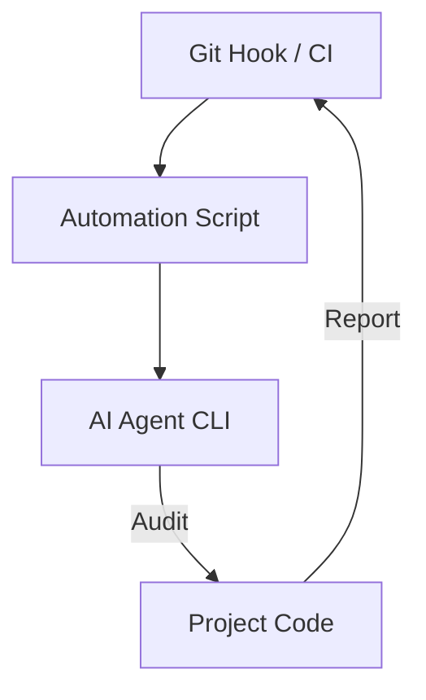

# CH-01: CLI Workflows

## 📖 1. Beyond the IDE GUI
Integrasi AI tidak terbatas pada jendela chat. Penggunaan **CLI (Command Line Interface)** untuk alur kerja agentik memungkinkan otomatisasi koding dalam skala besar.

## ⚙️ 2. Tool Integration
- **Cursor CLI**: Untuk membuka file atau folder langsung ke IDE dengan perintah shell.
- **Aider / OpenDevin CLI**: Menjalankan agen otonom di terminal yang bisa membaca input dari skrip bash.

## 📊 3. Automated Flow

## 🧪 4. Practical Lab
Membangun git-hook sederhana yang melakukan audit kode otomatis menggunakan AI sebelum `git commit` di terminal.
