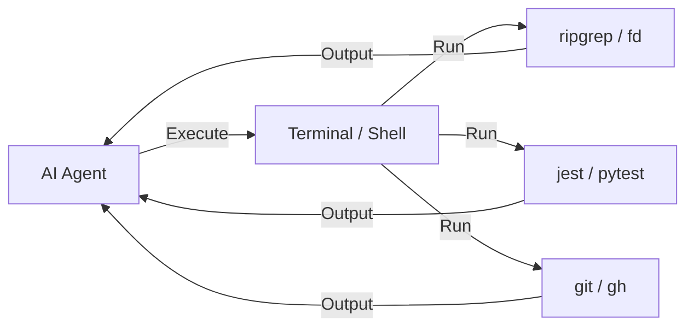

# BK-01: CLI for Agentic Workflows

> [!NOTE]
> This documentation follows the **PPM V4 Gold Standard**.

## 🔗 1. Source Link
- [Cursor CLI Documentation](https://docs.cursor.com/features/cli)
- [Shell Integration for AI Agents](https://code.visualstudio.com/docs/terminal/shell-integration)

## 📖 2. Brief & Detailed Explanation
### Brief
Menggunakan terminal sebagai perpanjangan tangan agen untuk melakukan tugas yang tidak bisa dilakukan lewat GUI.

### Detailed
Agen AI koding menjadi jauh lebih kuat ketika diberikan akses ke terminal. Dengan terminal, agen bisa menjalankan perintah `grep` untuk mencari file, `npm test` untuk memverifikasi kode, atau bahkan `git commit` untuk menyimpan progres. Rak ini membahas daftar tool CLI esensial yang harus dikuasai oleh pengembang agar bisa memandu agen dengan lebih efektif dalam terminal.

## 💡 3. Analogy
Memberikan terminal kepada agen adalah seperti memberikan **Lengan Robot** kepada sebuah komputer. Tanpa lengan, ia hanya bisa berpikir; dengan lengan, ia bisa memindahkan barang (file) dan memperbaiki mesin (kode) secara fisik.

## 📊 4. Mermaid Diagram

## ⚙️ 5. Under-the-hood Mechanics
Bagaimana *Terminal Buffer* dibaca oleh AI dan diparsing untuk memahami apakah sebuah perintah berhasil (exit code 0) atau gagal.

## 🧪 6. Practical Lab
Latihan alur kerja "Search-Edit-Test" sepenuhnya lewat terminal di `./examples/05-cli-workflow.md`.

## 📐 9. Chapter List
1. [CH-01: CLI Workflows](./CH-01-CLI-Workflows.md)

## ⚠️ 7. Pitfalls & Anti-Patterns
- **Blind Execution**: Menyuruh AI menjalankan perintah terminal yang berbahaya (seperti `rm -rf /`) tanpa memeriksa dampaknya.
- **Ignoring Output**: Tidak menyuruh AI membaca pesan error terminal, sehingga ia terus mencoba langkah yang sama berulang kali.
