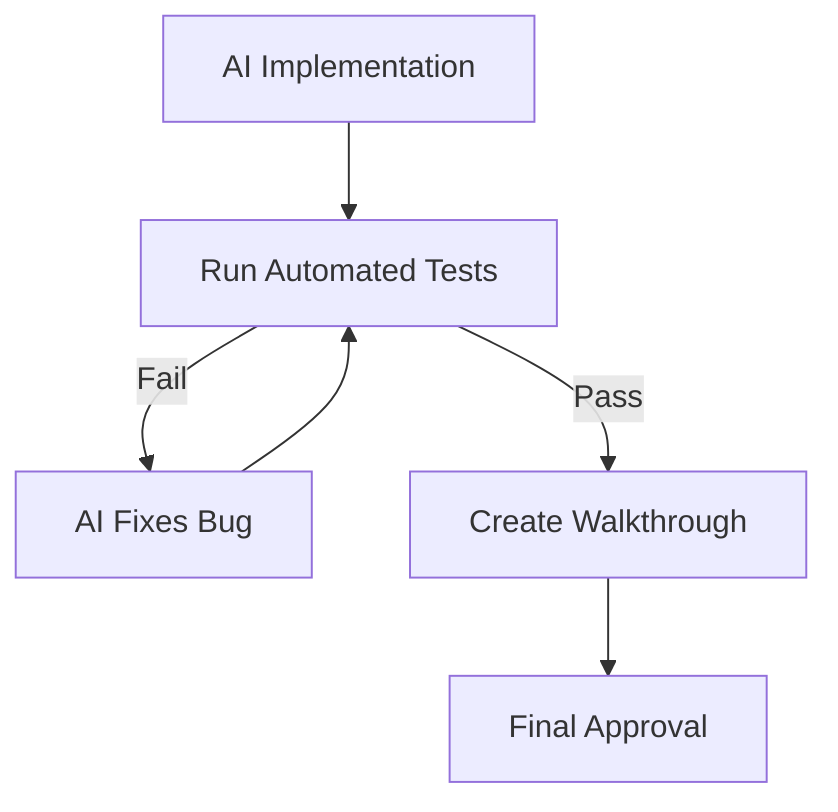

# BK-02: Automated Testing Integrations

> [!NOTE]
> This documentation follows the **PPM V4 Gold Standard**.

## 🔗 1. Source Link
- [Continuous Testing with AI](https://www.testim.io/blog/ai-in-software-testing/)
- [Playwright: Automated UI Testing](https://playwright.dev/)

## 📖 2. Brief & Detailed Explanation
### Brief
Membangun jaring pengaman (Guardrails) otomatis agar perubahan AI tidak merusak fitur yang sudah ada.

### Detailed
Integritas basis kode adalah prioritas utama. Dengan mengintegrasikan AI ke dalam siklus testing (seperti unit test, integration test, dan E2E test), kita mewajibkan setiap "Execution" untuk lolos uji sebelum dianggap selesai. Rak ini membahas cara memaksa AI untuk menjalankan test runner setiap kali selesai melakukan modifikasi file besar.

## 💡 3. Analogy
Seperti memiliki **Checkpost Keamanan** di setiap pintu keluar pabrik. Tidak ada barang yang bisa keluar (code merge) sebelum diperiksa oleh petugas QA (Automated Tests).

## 📊 4. Mermaid Diagram

## ⚙️ 5. Under-the-hood Mechanics
Teknik `test-driven prompt engineering` di mana kita memberikan output test yang gagal ke AI agar ia bisa melakukan *Self-Correction* secara otonom.

## 🧪 6. Practical Lab
Membangun "Auto-Fix Loop" sederhana di `./examples/05-testing-loop.md`.

## ⚠️ 7. Pitfalls & Anti-Patterns
- **Tests as Afterthought**: Baru menjalankan test setelah kodingan menumpuk banyak.
- **Weak Assertions**: Memiliki test yang selalu "Pass" meskipun kodenya salah karena logika pengujian yang tidak tajam.
