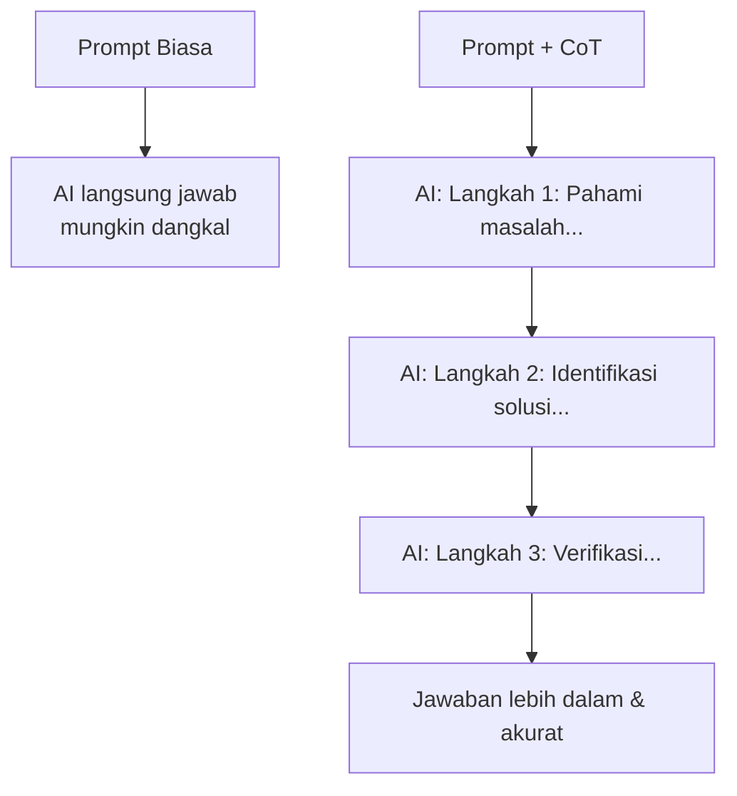

# RAK-06: The Underworld — Teknik Prompt Tingkat Lanjut & Context Management

## 🌟 Gampangnya...

Ini adalah rak paling "gelap" tapi paling powerful. Di sini kamu belajar teknik untuk memaksa AI benar-benar **membaca dan mengerti** instruksimu secara mendalam — bukan hanya sekilas. Juga teknik agar AI tidak "lupa" konteks di tengah sesi panjang dan berujung blunder. Kalau RAK-02 adalah aturannya, RAK-06 ini adalah cara memastikan AI *benar-benar* patuh pada aturan itu.

---

## 📖 Konteks & Sejarah

Dua masalah nyata yang sering dialami:
1. **Permukaan saja**: AI mengerjakan instruksimu secara dangkal, tidak membaca detailnya dengan cermat
2. **Context loss**: Di sesi panjang, AI mulai lupa konteks awal dan akhirnya blunder

Keduanya punya solusi berbeda tapi saling melengkapi. **Chain-of-Thought (CoT)** memaksa AI berpikir bertahap. **Context Anchoring** memastikan AI tidak kehilangan arah.

---

## ⚙️ Cara Kerja

### Chain-of-Thought (CoT) — Cara Kerja



**Prinsip**: Semakin kamu paksa AI untuk "menunjukkan pekerjaannya", semakin akurat hasilnya. Seperti detektif yang harus menunjukkan papan buktinya — bukan sekadar menyebut nama tersangka.

---

## 🗺️ Kapan Mode Ini Relevan

| Mode | Teknik yang Dipakai |
|---|---|
| 🔬 **ANALYZE** | Chain-of-Thought, Tree-of-Thought |
| 🐛 **DEBUG** | CoT untuk trace root cause |
| 📐 **BLUEPRINT** | Layered instruction untuk rancangan kompleks |
| ♻️ **REFACTOR** | Constraint-based prompting |

---

## 🛠️ Cara Pakai

### 1. Context Anchoring (Anti Context-Loss)

Ketik ini di **awal setiap sesi** untuk "melempar jangkar":
```
"Sebelum kita mulai, baca @session-notes.md 
 dan konfirmasi pemahamanmu dalam 3 poin:
 1. Apa yang sedang kita bangun?
 2. Keputusan arsitektural apa yang sudah dibuat?
 3. Apa yang akan kita kerjakan hari ini?"
```

### 2. Precision Prompting (Anti Permukaan)

Saat AI mengerjakan secara dangkal:
```
# SALAH (terlalu umum):
"Perbaiki autentikasi ini"

# BENAR (presisi):
"Baca @src/auth/middleware.ts baris 45-72.
 Identifikasi SEMUA edge case yang belum di-handle.
 Untuk setiap edge case:
 - Jelaskan apa yang terjadi sekarang
 - Jelaskan apa yang seharusnya terjadi
 - Baru setelah itu propose solusinya"
```

### 3. Anti-Blunder Checkpoint

Sebelum eksekusi apapun yang berisiko:
```
"Sebelum kamu mulai, konfirmasi:
 - File apa yang akan kamu ubah?
 - Apa yang TIDAK akan kamu ubah?
 - Jika ada yang tidak yakin, tanya dulu."
```

### 4. Chain-of-Thought untuk Debugging

```
"Debug error ini dengan Chain-of-Thought:
 Step 1: Baca error message dengan teliti
 Step 2: Trace ke baris kode yang paling mungkin jadi penyebab
 Step 3: Cek apakah ada fungsi lain yang memanggil ini
 Step 4: Propose fix, jelaskan MENGAPA fix ini akan berhasil
 Jangan langsung tulis kode sampai Step 4 selesai."
```

### 5. Context Recovery (Saat AI Sudah Blunder)

```
"Hentikan semua yang kamu lakukan.
 Baca ulang instruksi awal saya: [paste instruksi awal].
 Sekarang jelaskan: di mana kamu menyimpang dari instruksi itu?
 Kita mundur ke sebelum kesalahan dan mulai ulang dari sana."
```

---

## 🧪 Lab Praktek

**Skenario: ChatGPT mengerjakan instruksi panjang tapi hasilnya masih generik**

Kamu sudah nulis 5 paragraf instruksi detail, tapi AI tetap menghasilkan output standar.

**Solusi — Layered Instruction:**
```
"Sebelum kamu merespons, saya minta kamu lakukan ini dulu:
 1. Baca instruksi saya DUA KALI
 2. Identifikasi 3 poin PALING SPESIFIK dari permintaan saya
 3. Konfirmasi ke saya: 'Saya pahami bahwa kamu ingin [X], 
    bukan [Y yang umum]. Benar?'
 Baru setelah saya konfirmasi, kerjakan."
```

---

## ⚠️ Jebakan & Solusi

| Jebakan | Gejala | Solusi |
|---|---|---|
| **Surface-level response** | Output generik meski instruksi detail | Gunakan Precision Prompting + layered instruction |
| **Context drift** | AI melenceng dari tujuan awal di sesi panjang | Context Anchoring di awal sesi + session-notes.md |
| **Confident blunder** | AI yakin tapi salah total | Pakai checkpoint sebelum EXECUTE |
| **CoT overkill** | CoT dipakai untuk task sepele → lambat & boros quota | CoT hanya untuk task kompleks: debug, arsitektur, analisis |

---

### 🗂️ Sub-Rak & Buku
- **SR-01: Logic & Reasoning**
  - BK-01: Chain-of-Thought Deep Dive
  - BK-02: Tree-of-Thought untuk Arsitektur Kompleks
- **SR-02: Advanced Prompt Patterns**
  - BK-01: Few-Shot in Coding (Memberi Contoh ke AI)
  - BK-02: Constraint-Based Prompting
  - BK-03: Context Management Playbook
