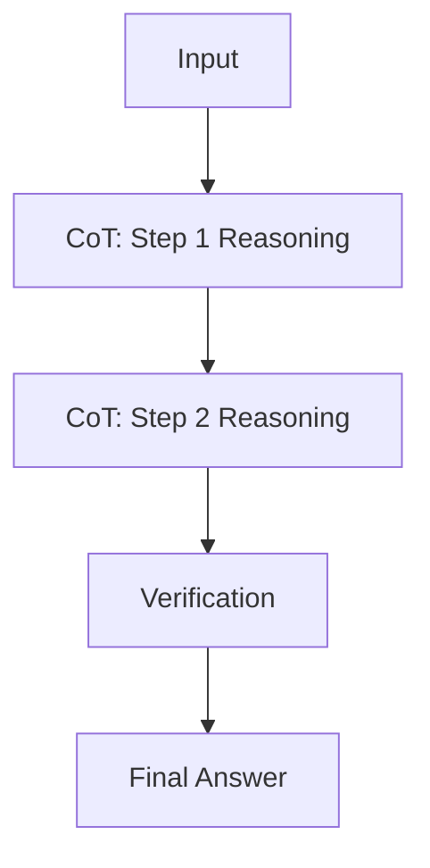

# RAK-06: The Underworld

> [!NOTE]
> This documentation follows the **PPM V4 Gold Standard**.

## 🔗 1. Source Link
- [Chain-of-Thought Prompting (Google Research)](https://blog.research.google/2022/05/language-models-perform-reasoning-via.html)
- [Tree-of-Thought (Princeton/DeepMind)](https://arxiv.org/abs/2305.10601)

## 📖 2. Brief & Detailed Explanation
### Brief
Teknik Prompting Tingkat Dewa: Chain-of-Thought, Tree-of-Thought, dan Few-Shot Patterns.

### Detailed
Memasuki area "Logika Hitam" di mana kita memaksa AI untuk berpikir ribuan kali lebih dalam sebelum memberikan output. Menggunakan pola-pola penalaran kompleks untuk memecahkan masalah bug yang sangat sulit atau desain sistem yang rumit.

## 💡 3. Analogy
Meminta detektif (AI) bukan hanya untuk menebak siapa pembunuhnya, tapi untuk menunjukkan papan bukti dengan semua benang merah (Chain-of-Thought) yang terhubung.

## 📊 4. Mermaid Diagram

## 🏛️ 8. Granular Structure (The Taxonomy)

### [SR-01: Logic & Reasoning](./SR-01-Logic-and-Reasoning/)
- [BK-01: Chain-of-Thought Deep Dive](./SR-01-Logic-and-Reasoning/BK-01-Chain-of-Thought-Deep-Dive/README.md)
- [BK-02: Tree-of-Thought Orchestration](./SR-01-Logic-and-Reasoning/BK-02-Tree-of-Thought-Orchestration/README.md)

### [SR-02: Advanced Prompt Patterns](./SR-02-Advanced-Prompt-Patterns/)
- [BK-01: Few-Shot in Coding](./SR-02-Advanced-Prompt-Patterns/BK-01-Few-Shot-in-Coding/README.md)
- [BK-02: Constraint-Based Prompting](./SR-02-Advanced-Prompt-Patterns/BK-02-Constraint-Based-Prompting/README.md)

---

> [!CAUTION]
> Teknik di Rak ini sangat kuat, namun gunakanlah dengan bijak. Terlalu banyak teknik penalaran pada masalah sepele hanya akan menghabiskan credit API Anda secara sia-sia.
