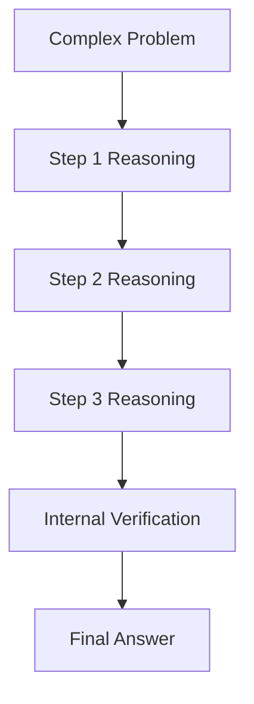

# BK-01: Chain-of-Thought Deep Dive

> [!NOTE]
> This documentation follows the **PPM V4 Gold Standard**.

## 🔗 1. Source Link
- [Chain-of-Thought Prompting Elicits Reasoning in Large Language Models](https://arxiv.org/abs/2201.11903)
- [Let's Think Step by Step (Wei et al.)](https://openai.com/blog/instruction-following/)

## 📖 2. Brief & Detailed Explanation
### Brief
Teknik memaksa AI untuk menunjukkan langkah-langkah penalaran internalnya sebelum memberikan jawaban akhir.

### Detailed
**Chain-of-Thought (CoT)** adalah teknik di mana kita menginstruksikan AI untuk memecah masalah kompleks menjadi urutan langkah logika yang lebih kecil. Dengan menuliskan "Thought" atau "Reasoning" terlebih dahulu, model bahasa dapat menggunakan token tersebut sebagai memori kerja untuk memperbaiki kesalahannya sendiri sebelum sampai pada kesimpulan. Ini sangat krusial untuk debugging algoritma atau arsitektur sistem yang rumit.

## 💡 3. Analogy
Membayangkan seorang murid matematika. Bukannya langsung menulis jawaban "42", murid tersebut menuliskan **cara jalannya** di kertas buram. Jika cara jalannya benar, kemungkinan besar jawabannya juga benar.

## 📊 4. Mermaid Diagram

## ⚙️ 5. Under-the-hood Mechanics
Menjelaskan fenomena *Computational Window*: Bagaimana setiap token reasoning yang dihasilkan oleh model bertindak sebagai input kontekstual untuk token berikutnya, meningkatkan probabilitas prediksi yang tepat pada logika yang sulit.

## 🧪 6. Practical Lab
Perbandingan akurasi AI dengan dan tanpa CoT pada masalah logika koding di `./examples/06-cot-experiment.md`.

## ⚠️ 7. Pitfalls & Anti-Patterns
- **Reasoning Hallucination**: AI menulis langkah penalaran yang terlihat logis tapi sebenarnya mengandung premis yang salah.
- **Over-thought**: Menggunakan CoT untuk pertanyaan sangat sederhana (seperti "Apa itu variabel?"), yang hanya membuang-buang token dan waktu.
