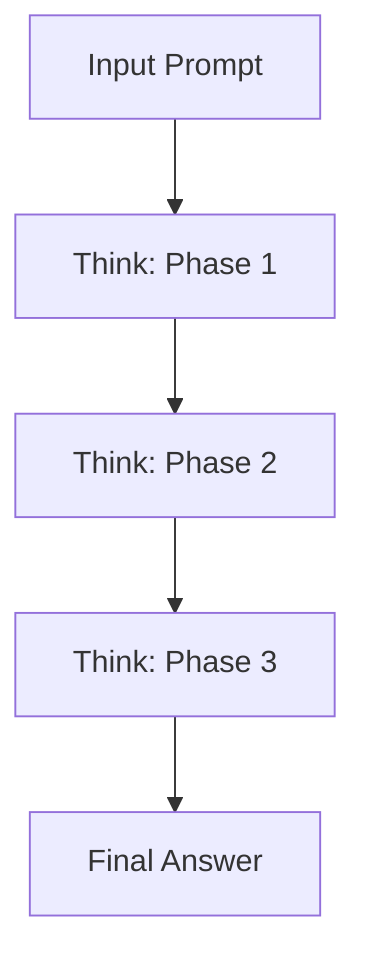

# CH-01: Chain of Thought Optimization

## 📖 1. Thinking before Speaking
**Chain of Thought (CoT)** adalah teknik di mana AI dipaksa untuk menuliskan langkah-langkah penalarannya secara eksplisit sebelum memberikan jawaban akhir.

## ⚙️ 2. CoT Prompting
- **Step-by-Step Instruction**: Memulai instruksi dengan "Mari berpikir selangkah demi selangkah".
- **Self-Correction**: Memberikan instruksi agar AI mengecek kembali jawabannya sendiri sebelum menampilkannya kepada pengguna.

## 📊 3. CoT Mechanics

## 🚀 4. Benefit
Mengurangi kesalahan logika drastis pada tugas matematika atau pemrograman kompleks karena AI memiliki "ruang coretan" untuk memproses ide sebelum mengeksekusinya.
