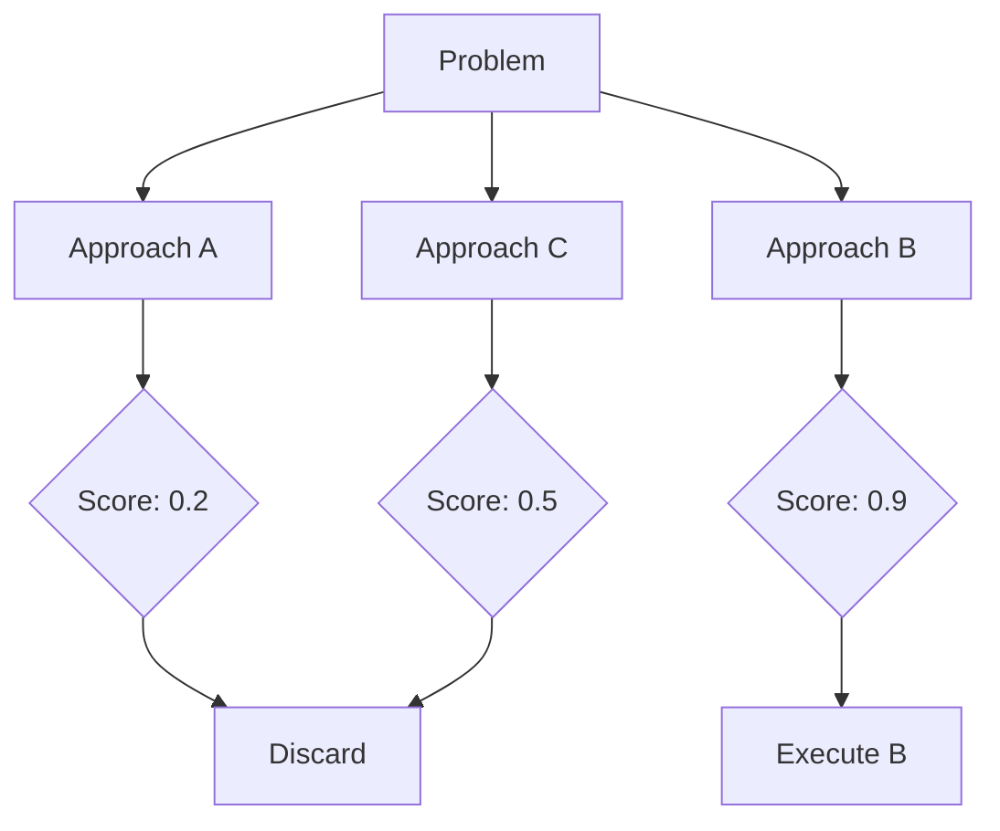

# BK-02: Tree-of-Thought Orchestration

> [!NOTE]
> This documentation follows the **PPM V4 Gold Standard**.

## 🔗 1. Source Link
- [Tree of Thoughts: Deliberate Problem Solving with Large Language Models](https://arxiv.org/abs/2305.10601)
- [Implementing ToT for Coding Tasks](https://github.com/princeton-nlp/tree-of-thought-llm)

## 📖 2. Brief & Detailed Explanation
### Brief
Teknik penalaran tingkat lanjut di mana AI mengeksplorasi beberapa solusi alternatif secara bersamaan dan memilih yang terbaik.

### Detailed
**Tree-of-Thought (ToT)** melangkah lebih jauh dari CoT. AI tidak hanya berpikir lurus, tapi membangun pohon pencarian (*search tree*). AI menghasilkan beberapa ide (cabang), mengevaluasi masing-masing ide tersebut, membuang yang buruk, dan melanjutkan pada cabang yang paling menjanjikan. Ini sangat efektif untuk optimasi performa atau pemilihan design pattern di mana ada banyak cara untuk mencapai satu tujuan.

## 💡 3. Analogy
Seperti seorang pemain catur yang membayangkan 3 langkah ke depan untuk 4 kemungkinan gerakan yang berbeda, lalu memilih gerakan yang memberikan posisi paling menguntungkan.

## 📊 4. Mermaid Diagram

## ⚙️ 5. Under-the-hood Mechanics
Bagaimana agen dapat mengorkestrasikan beberapa *inference calls* untuk bertindak sebagai "Generator" dan "Evaluator" dalam satu siklus ToT.

## 🧪 6. Practical Lab
Simulasi pemilihan arsitektur database menggunakan metode ToT di `./examples/06-tot-simulation.md`.

## ⚠️ 7. Pitfalls & Anti-Patterns
- **Analysis Paralysis**: Mengeksplorasi terlalu banyak cabang sehingga tidak pernah sampai pada keputusan akhir.
- **Biased Evaluation**: Agen evaluator yang terlalu permisif sehingga meloloskan solusi yang sebenarnya tidak optimal.
