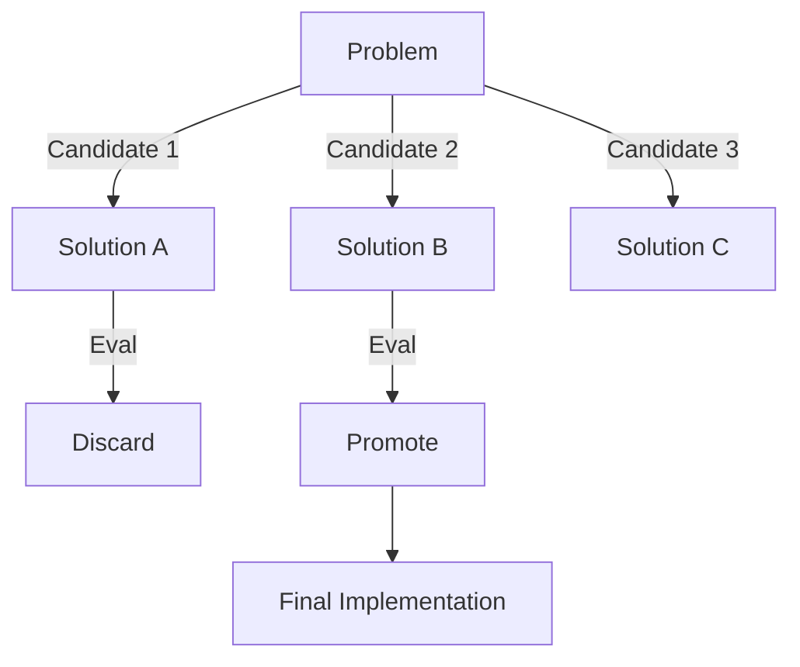

# CH-01: Tree of Thought Orchestration

## 📖 1. Exploring Multiple Paths
**Tree of Thought (ToT)** melangkah lebih jauh dari CoT dengan membiarkan AI mengeksplorasi beberapa cabang solusi secara paralel dan mengevaluasi mana yang terbaik.

## ⚙️ 2. ToT Workflow
- **Candidate Generation**: AI membuat 3-4 alternatif solusi.
- **Evaluation**: AI memberikan skor untuk masing-masing solusi berdasarkan kriteria tertentu.
- **Search**: AI memilih jalur dengan skor tertinggi untuk dilanjutkan.

## 📊 3. Tree Structure

## 🧪 4. Practical Implementation
Menginstruksikan AI untuk memberikan 3 opsi arsitektur saat akan membedah modul baru, lengkap dengan analisa *pros* dan *cons* masing-masing.
