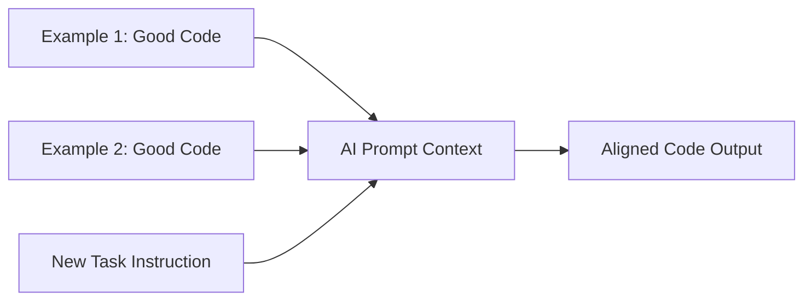

# BK-01: Few-Shot in Coding

> [!NOTE]
> This documentation follows the **PPM V4 Gold Standard**.

## 🔗 1. Source Link
- [Few-Shot Prompting (Prompt Engineering Guide)](https://www.promptingguide.ai/techniques/fewshot)
- [In-Context Learning in LLMs](https://arxiv.org/abs/2005.14165)

## 📖 2. Brief & Detailed Explanation
### Brief
Memberikan beberapa contoh pasangan (Input -> Output) kepada AI untuk menstandarisasi gaya dan kualitas kodingnya.

### Detailed
LLM adalah pembelajar kontekstual yang sangat baik. Daripada hanya memberikan instruksi verbal seperti "Tulis kode yang rapi", lebih baik memberikan 2-3 contoh kode nyata yang Anda anggap "Rapi". Teknik **Few-Shot** ini sangat ampuh untuk memaksa AI mengikuti gaya penulisan nama variabel tertentu, struktur folder, atau cara penulisan komentar yang sesuai dengan standar internal tim Anda.

## 💡 3. Analogy
Seperti menunjukkan beberapa foto masakan yang sudah jadi kepada koki baru. Bukannya menjelaskan "Nasi gorengnya harus terlihat cokelat keemasan", cukup tunjukkan 3 piring nasi goreng yang sempurna sebagai acuan.

## 📊 4. Mermaid Diagram

## ⚙️ 5. Under-the-hood Mechanics
Menjelaskan konsep *In-Context Learning*: Bagaimana model menyesuaikan bobot prediksinya berdasarkan pola yang baru saja dilihatnya dalam jendela konteks tanpa melakukan fine-tuning permanen.

## 🧪 6. Practical Lab
Membuat "Style Guardrail" menggunakan few-shot di `./examples/06-few-shot-styling.md`.

## ⚠️ 7. Pitfalls & Anti-Patterns
- **Example Bias**: Memberikan contoh yang mengandung bug, sehingga AI akan mereplikasi bug tersebut ke tugas baru.
- **Over-fitting to Examples**: AI menjadi terlalu kaku dan tidak bisa beradaptasi jika tugas baru sedikit berbeda dari contoh yang diberikan.
