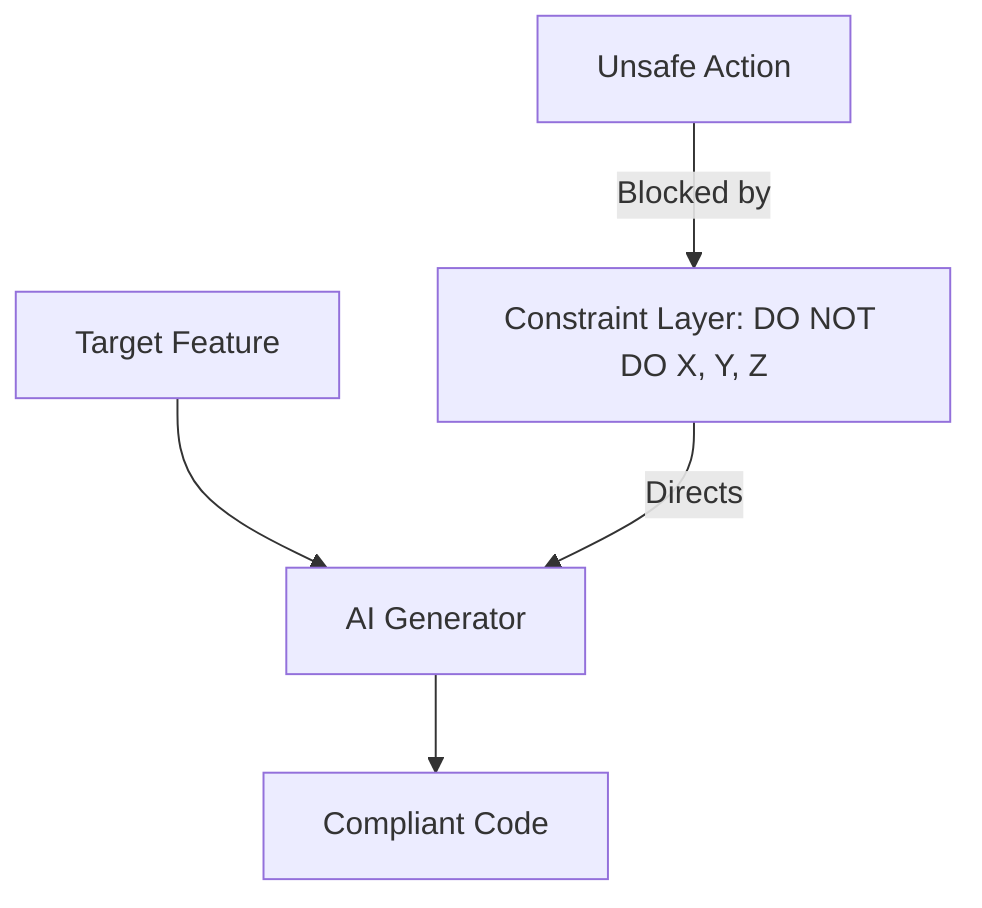

# BK-02: Constraint-Based Prompting

> [!NOTE]
> This documentation follows the **PPM V4 Gold Standard**.

## 🔗 1. Source Link
- [Negative Prompting Techniques](https://zapier.com/blog/ai-negative-prompt/)
- [Safety and Guardrails in LLMs](https://github.com/NVIDIA/NeMo-Guardrails)

## 📖 2. Brief & Detailed Explanation
### Brief
Teknik memberikan daftar "Larangan" dan "Batasan Keras" untuk mempersempit ruang gerak AI agar tidak melakukan kesalahan umum.

### Detailed
Sering kali memberitahu AI apa yang **TIDAK BOLEH** dilakukan lebih efektif daripada memberitahu apa yang harus dilakukan. **Constraint-Based Prompting** menggunakan struktur "Negative Constraints" (misal: "Jangan gunakan library A", "Jangan ubah file B", "Jangan gunakan async/await"). Ini menciptakan koridor eksekusi yang sangat aman dan mencegah AI melakukan halusinasi fitur yang tidak kita inginkan.

## 💡 3. Analogy
Membayangkan AI sebagai pengemudi. Anda tidak hanya memberitahu tujuan (Goal), tapi juga memasang **pagar pembatas jalan** (Constraints) agar mobil tidak jatuh ke jurang meskipun pengemudi mencoba bermanuver.

## 📊 4. Mermaid Diagram

## ⚙️ 5. Under-the-hood Mechanics
Bagaimana batasan (constraints) diletakkan di bagian akhir prompt untuk meningkatkan *Recency Bias* agar model lebih patuh pada larangan tersebut.

## 🧪 6. Practical Lab
Eksperimen "No-Library Challenge" menggunakan constraints di `./examples/06-constraint-challenge.md`.

## ⚠️ 7. Pitfalls & Anti-Patterns
- **Constraint Conflict**: Memberikan dua batasan yang saling bertolak belakang (misal: "Bikin kode pendek" tapi "Tulis komentar sangat panjang").
- **Over-constrained**: Memberikan terlalu banyak batasan sehingga AI tidak bisa menemukan solusi valid sama sekali.
