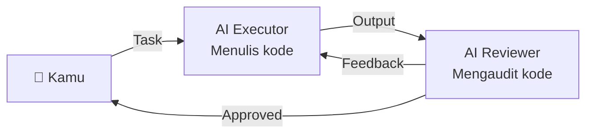

# RAK-07: Specialization — Kerja Tim AI & Audit Berlapis

## 🌟 Gampangnya...

Bayangkan kamu punya tim: satu AI yang ngoding, satu lagi yang bertugas ngecek kodenya. Ini bukan khayalan — ini adalah **Multi-Agent Workflow** yang bisa kamu setup sekarang. RAK ini mengajarkan cara mengatur AI agar bekerja seperti tim profesional: ada yang draft, ada yang review, ada yang approve. Hasilnya: kode yang lebih bersih dengan lebih sedikit bug.

---

## 📖 Konteks & Sejarah

Satu AI yang mengerjakan semuanya rentan bias terhadap output-nya sendiri — seperti penulis yang menjadi editor tulisannya sendiri. **Reviewer AI** adalah AI kedua (atau instance AI kedua) yang tugasnya spesifik: mencari kesalahan, inkonsistensi, dan celah keamanan. Teknik ini populer di tim senior engineer untuk gate quality.

---

## ⚙️ Cara Kerja

### Multi-Agent Review Flow



Dalam praktiknya dengan satu Cursor: AI Executor dan AI Reviewer bisa menjadi **dua sesi chat berbeda**, atau satu sesi dengan instruksi role-switch eksplisit.

---

## 🗺️ Kapan Mode Ini Relevan

| Mode | Kapan Pakai |
|---|---|
| 🔍 **REVIEW** | Setelah setiap EXECUTE — wajib sebelum commit |
| 🧪 **TEST** | Setelah review lolos — jalankan test |
| 📝 **DOCUMENT** | Setelah kode final — dokumentasikan perubahan |

---

## 🛠️ Cara Pakai

### Ritual Setelah Setiap EXECUTE (Wajib)

```
"Audit kode yang baru saja kamu tulis. 
 Cari MINIMAL 3 hal: 
 1. Potensi error atau edge case yang tidak di-handle
 2. Inkonsistensi dengan gaya kode yang ada
 3. Hal yang bisa disederhanakan
 Beri nilai 1-10 kualitas kode ini."
```

### Cross-Reference dengan Standar

```
"Bandingkan implementasimu dengan @RAK-02.
 Apakah semua protokol DISCUSS/EXECUTE sudah diikuti?
 Ada yang dilanggar?"
```

### Final Handover (Sebelum Tutup Sesi)

```
"Sebelum kita tutup sesi ini, buat ringkasan:
 1. File apa saja yang diubah (dengan alasannya)
 2. Apa yang masih belum selesai / technical debt
 3. Hal yang perlu diingat di sesi berikutnya"
```

---

## 🧪 Lab Praktek

**Skenario: Role-switch Executor → Reviewer dalam satu sesi**

```
# Setelah AI selesai coding:
"Sekarang ganti peran. Bukan sebagai developer yang baru nulis kode ini,
 tapi sebagai Senior Code Reviewer yang skeptis. 
 Baca kode yang barusan kamu tulis. Apa yang akan kamu protes?"
```

AI akan sering menemukan masalahnya sendiri dengan teknik ini — dan memperbaikinya.

---

## ⚠️ Jebakan & Solusi

| Jebakan | Gejala | Solusi |
|---|---|---|
| **Self-review bias** | AI review kodenya sendiri dan bilang "sudah bagus" | Minta AI ganti peran dulu sebelum review |
| **Review terlalu umum** | AI bilang "kode sudah baik" tanpa detail | Paksa dengan: "Cari MINIMAL 3 masalah spesifik" |
| **Lupa document** | Sesi ditutup tanpa log perubahan | Jadikan Final Handover sebagai ritual wajib |

---

### 🗂️ Sub-Rak & Buku
- **SR-01: Multi-Agent Patterns**
  - [BK-01: Role Switching Patterns](./SR-01-Multi-Agent-Patterns/BK-01-Role-Switching-Patterns/README.md)
  - [BK-02: The Critic Pattern](./SR-01-Multi-Agent-Patterns/BK-02-The-Critic-Pattern/README.md)
- **SR-02: Review Rituals**
  - [BK-01: Post-Execute Audit Ritual](./SR-02-Review-Rituals/BK-01-Post-Execute-Audit-Ritual/README.md)
