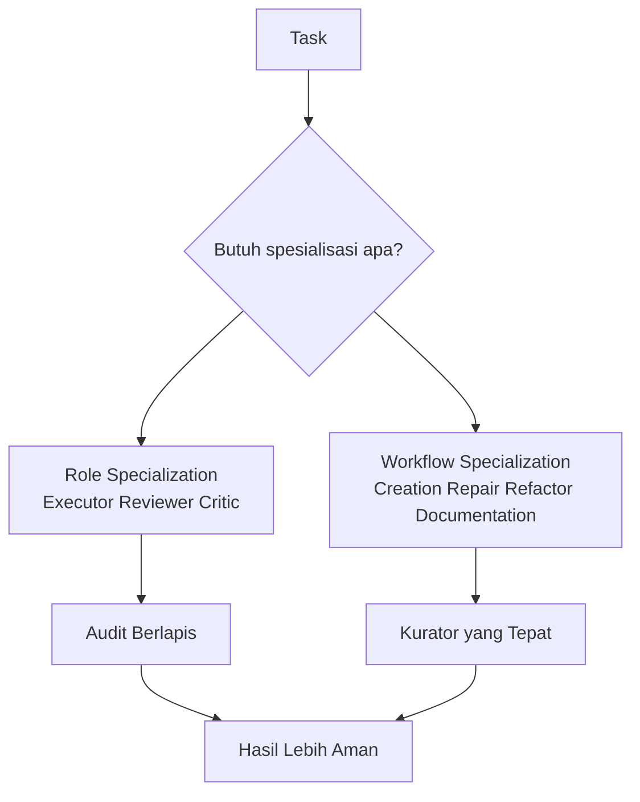

# RAK-07: Specialization - Workflow Spesialis, Audit Berlapis, dan Kurator Kerja

## Gampangnya...

Kalau rak-rak sebelumnya mengajari hukum dasar dan cara kerja umum, maka `RAK-07` mengajari cara membuat AI bekerja seperti **spesialis**. Di sini AI tidak lagi diperlakukan sebagai satu tukang serba bisa, tetapi sebagai sistem kerja yang bisa dibagi per peran, per ritual, dan per jenis operasi.

Makanya isi rak ini sekarang punya dua wajah yang saling melengkapi:
- pola kerja **multi-agent dan reviewer**,
- pola kerja **kurator workflow** untuk creation, repair, refactor, dan documentation.

---

## Konteks & Sejarah

Begitu user mulai serius memakai AI untuk kerja teknis, masalahnya berubah. Bukan lagi sekadar "AI bisa bantu atau tidak", tetapi:
- siapa yang mengeksekusi,
- siapa yang mengkritik,
- workflow mana yang dipakai,
- kapan task harus diperlakukan sebagai pembangunan baru,
- kapan ia harus diperlakukan sebagai pemulihan, pembenahan, atau dokumentasi.

Tanpa spesialisasi seperti ini, satu AI cenderung:
- menilai karyanya sendiri terlalu lunak,
- bugfix melebar menjadi refactor,
- refactor menyamar sebagai rewrite,
- dokumentasi tertinggal dan pengetahuan sesi hilang.

---

## Cara Kerja

### Dua Pilar Specialization

### Peta Isi Rak

| Pilar | Fungsi |
|---|---|
| **Multi-Agent Patterns** | Membagi kerja berdasarkan peran seperti executor, critic, reviewer |
| **Review Rituals** | Memastikan hasil eksekusi diaudit sebelum dianggap selesai |
| **Curator Workflows** | Memilih workflow yang tepat berdasarkan jenis operasi terhadap proyek |

---

## Kapan Digunakan

RAK ini relevan ketika kamu mulai menghadapi pertanyaan seperti:
- "Apakah saya butuh reviewer terpisah?"
- "Task ini creation, repair, refactor, atau documentation?"
- "Bagaimana caranya agar AI tidak memeriksa pekerjaannya sendiri dengan terlalu lunak?"
- "Kapan saya harus mengganti workflow, bukan cuma mengganti prompt?"

Kalau masalahmu sudah naik dari level aturan dasar ke level **orkestrasi spesialis**, maka ini rak yang tepat.

---

## Cara Pakai

### Jika Masalahmu Soal Peran

Masuk ke:
- `SR-01: Multi-Agent Patterns`

Gunakan saat kamu ingin membedakan:
- executor,
- critic,
- reviewer,
- atau role switching dalam satu sesi.

### Jika Masalahmu Soal Audit

Masuk ke:
- `SR-02: Review Rituals`

Gunakan saat kamu ingin menutup eksekusi dengan:
- audit,
- test,
- handover,
- evaluasi kualitas hasil.

### Jika Masalahmu Soal Jenis Workflow

Masuk ke:
- `SR-03: Curator Workflows`

Gunakan saat kamu perlu menentukan apakah task ini:
- `Creation`
- `Repair`
- `Refactor`
- `Documentation`

### Aturan Praktis

- jangan pakai satu workflow untuk semua jenis tugas,
- jangan biarkan executor menjadi hakim tunggal pekerjaannya sendiri,
- jika task berubah tujuan di tengah jalan, klasifikasikan ulang secara sadar.

---

## Lab Praktek

**Skenario 1: Feature baru besar**

Task:
"Saya ingin membangun dashboard admin baru."

Pendekatan yang tepat:
- pakai `Curator Workflow: Creation`
- lalu gunakan reviewer di akhir fase implementasi.

**Skenario 2: Bug sulit**

Task:
"Login sering gagal saat traffic tinggi."

Pendekatan yang tepat:
- pakai `Curator Workflow: Repair`
- jika fix sudah stabil, tutup dengan ritual review dan documentation.

**Skenario 3: Refactor besar**

Task:
"Rapikan modul ini tanpa mengubah behavior."

Pendekatan yang tepat:
- pakai `Curator Workflow: Refactor`
- tambahkan audit reviewer agar perubahan tetap aman.

---

## Jebakan & Solusi

| Jebakan | Gejala | Solusi |
|---|---|---|
| **Satu AI, semua peran** | Executor sekaligus reviewer sekaligus critic tanpa batas | Pisahkan peran atau pakai role switching yang eksplisit |
| **Satu workflow untuk semua task** | Task creation diperlakukan seperti bugfix atau sebaliknya | Klasifikasikan task sebelum eksekusi |
| **Audit terlambat** | Review baru dilakukan saat semuanya sudah telanjur besar | Jadikan review sebagai ritual per fase |
| **Kurator tidak dikenali** | AI masuk mode yang salah sejak awal | Gunakan template klasifikasi task di SR-03 |

---

### Sub-Rak & Buku
- **SR-01: Multi-Agent Patterns**
  - [BK-01: Role Switching Patterns](./SR-01-Multi-Agent-Patterns/BK-01-Role-Switching-Patterns/README.md)
  - [BK-02: The Critic Pattern](./SR-01-Multi-Agent-Patterns/BK-02-The-Critic-Pattern/README.md)
- **SR-02: Review Rituals**
  - [BK-01: Post-Execute Audit Ritual](./SR-02-Review-Rituals/BK-01-Post-Execute-Audit-Ritual/README.md)
- **SR-03: Curator Workflows**
  - [BK-01: Kurator untuk Project Baru](./SR-03-Curator-Workflows/BK-01-Kurator-untuk-Project-Baru/README.md)
  - [BK-02: Kurator untuk Perbaikan dan Bugfix](./SR-03-Curator-Workflows/BK-02-Kurator-untuk-Perbaikan-dan-Bugfix/README.md)
  - [BK-03: Kurator untuk Refactor dan Pembenahan](./SR-03-Curator-Workflows/BK-03-Kurator-untuk-Refactor-dan-Pembenahan/README.md)
  - [BK-04: Kurator untuk Dokumentasi dan Handover](./SR-03-Curator-Workflows/BK-04-Kurator-untuk-Dokumentasi-dan-Handover/README.md)
