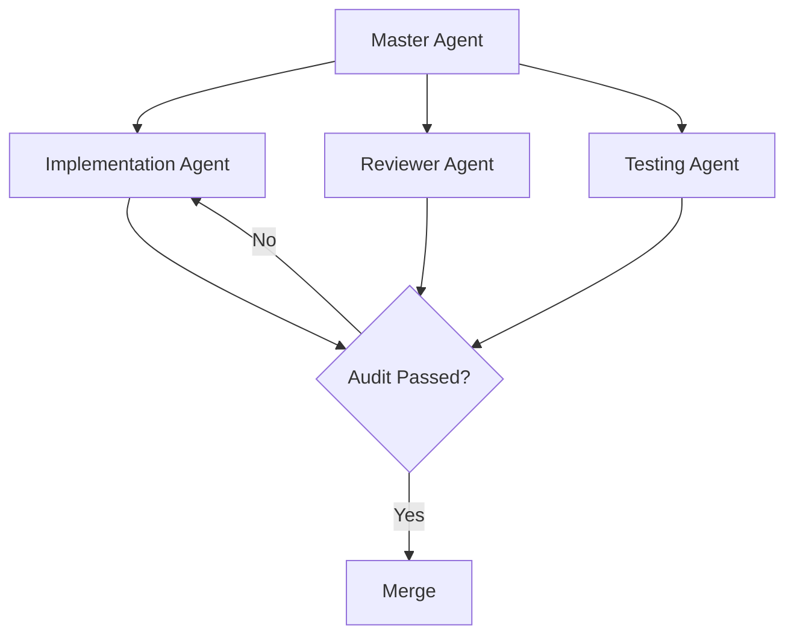

# RAK-07: Specialization

> [!NOTE]
> This documentation follows the **PPM V4 Gold Standard**.

## 🔗 1. Source Link
- [Multi-Agent System Orchestration](https://microsoft.github.io/autogen/)
- [Automated Code Review Practices](https://www.atlassian.com/agile/software-development/code-reviews)

## 📖 2. Brief & Detailed Explanation
### Brief
Orkestrasi Multi-Agen, Audit Otomatis, dan Guardrails Refactoring.

### Detailed
Membahas skenario tingkat lanjut di mana satu tugas dikerjakan oleh beberapa spesialis AI. Bagaimana membangun sistem audit otomatis untuk menjaga agar kualitas kode tidak menurun saat melakukan refactoring besar-besaran.

## 💡 3. Analogy
Seperti konduktor orkestra yang memastikan pemain biola, pianis, dan peniup saksofon (Agen-Agen Spesifik) bermain dalam harmoni yang sama (Goal Proyek).

## 📊 4. Mermaid Diagram

## 🏛️ 8. Granular Structure (The Taxonomy)

### [SR-01: Multi-Agent Orchestration](./SR-01-Multi-Agent-Orchestration/)
- [BK-01: The Chorus of Agents](./SR-01-Multi-Agent-Orchestration/BK-01-The-Chorus-of-Agents/README.md)
- [BK-02: Role Separation: Coder, Reviewer, Tester](./SR-01-Multi-Agent-Orchestration/BK-02-Role-Separation-Coder-Reviewer-Tester/README.md)

### [SR-02: Audit & Guardrails](./SR-02-Audit-and-Guardrails/)
- [BK-01: Automated Review Workflows](./SR-02-Audit-and-Guardrails/BK-01-Automated-Review-Workflows/README.md)
- [BK-02: Refactoring Guardrails](./SR-02-Audit-and-Guardrails/BK-02-Refactoring-Guardrails/README.md)

---

> [!IMPORTANT]
> Kekuatan sesungguhnya bukan pada satu AI yang cerdas, melainkan pada ekosistem agen yang saling mengoreksi satu sama lain.
