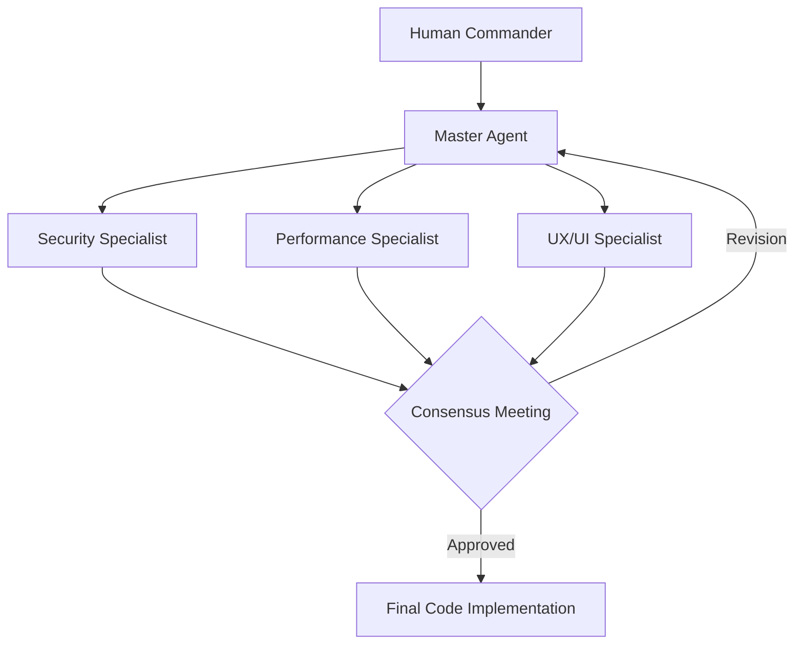

# BK-01: The Chorus of Agents

> [!NOTE]
> This documentation follows the **PPM V4 Gold Standard**.

## 🔗 1. Source Link
- [Multi-Agent Systems: A Survey](https://arxiv.org/abs/2401.03428)
- [Microsoft AutoGen: Enabling Next-Gen LLM Applications](https://microsoft.github.io/autogen/)

## 📖 2. Brief & Detailed Explanation
### Brief
Memahami konsep orkestrasi di mana beban kerja dibagi ke beberapa Agen spesialis yang saling berinteraksi.

### Detailed
Dalam pengembangan perangkat lunak skala besar, satu Agen tunggal sering kali mengalami "Context Fatigue" atau bias. **Chorus of Agents** adalah pendekatan di mana kita menggunakan beberapa instance agen yang memiliki peran berbeda. Satu agen fokus pada penulisan kode, agen lain fokus pada keamanan, dan agen ketiga fokus pada performa. Mereka berdialog dalam satu sesi untuk mencapai konsensus terbaik bagi basis kode.

## 💡 3. Analogy
Seperti **Dewan Juri** dalam sebuah kompetisi memasak. Ada juri yang menilai rasa, juri yang menilai presentasi, dan juri yang menilai kebersihan. Makanan (Kode) baru dinyatakan lolos jika semua juri memberikan nilai positif.

## 📊 4. Mermaid Diagram

## ⚙️ 5. Under-the-hood Mechanics
Menjelaskan teknik *Inter-Agent Communication* melalui *shared message history* dan bagaimana mengelola *Token Budget* saat menjalankan beberapa agen sekaligus.

## 🧪 6. Practical Lab
Simulasi diskusi multi-agen untuk fitur baru di `./examples/07-agent-chorus.md`.

## ⚠️ 7. Pitfalls & Anti-Patterns
- **Agent Groupthink**: Agen-agen yang terlalu cepat setuju satu sama lain tanpa melakukan kritik yang tajam.
- **Orchestration Overhead**: Waktu dan token yang terbuang terlalu banyak untuk koordinasi dibandingkan untuk eksekusi nyata.
