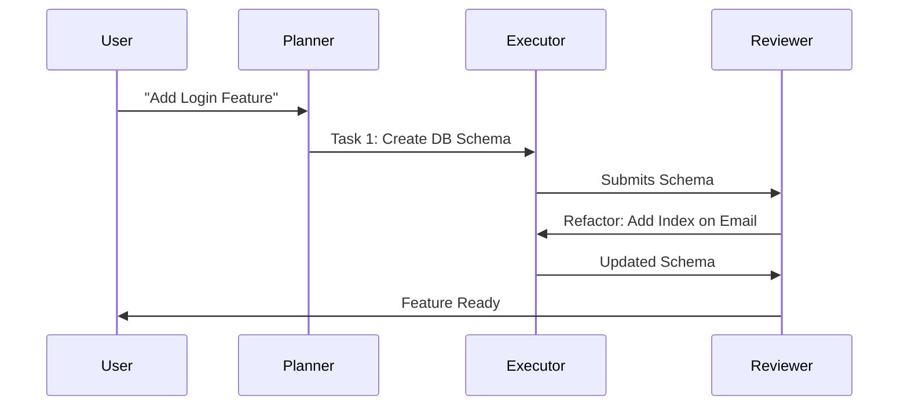

# CH-01: Chorus of Agents Workflow

## 📖 1. The Power of Many
**Chorus of Agents** adalah teknik orkestrasi di mana beberapa agen dengan persona khusus bekerja sama di bawah arahan satu agen utama (Orchestrator) atau User.

## ⚙️ 2. The Orchestration Pattern
1. **Planner**: Membedah tugas menjadi sub-tugas.
2. **Executor**: Menulis kode berdasarkan sub-tugas.
3. **Reviewer**: Memeriksa bug dan standar koding.
4. **Fixer**: Memperbaiki temuan reviewer.

## 📊 3. Collaboration Diagram

## ⚠️ 4. Orchestration Overhead
Semakin banyak agen, semakin besar risiko desinkronisasi. Pastikan ada "Single Source of Truth" (seperti Blueprint di RAK-02) yang bisa diakses oleh seluruh agen.
