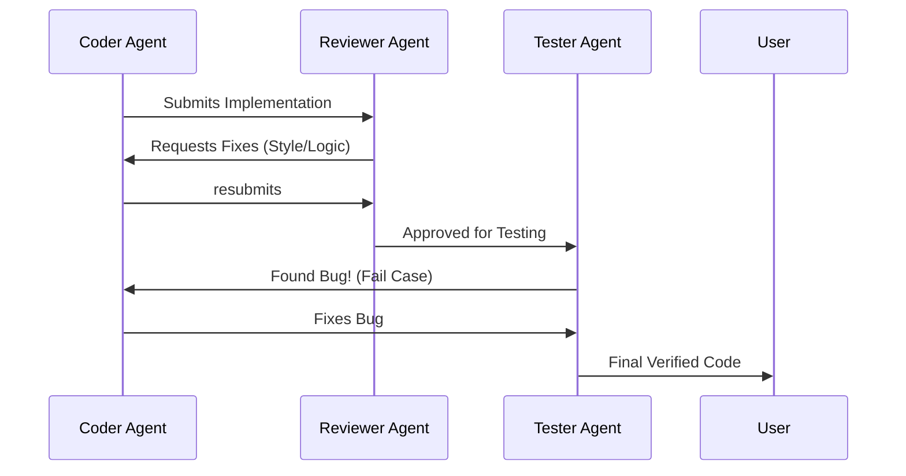

# BK-02: Role Separation: Coder, Reviewer, Tester

> [!NOTE]
> This documentation follows the **PPM V4 Gold Standard**.

## 🔗 1. Source Link
- [Role-based Access Control in AI Workflows](https://www.deeplearning.ai/the-batch/agentic-design-patterns-part-3-tool-use/)

## 📖 2. Brief & Detailed Explanation
### Brief
Membagi tugas ke dalam tiga peran fundamental (Coder, Reviewer, Tester) untuk menjamin kualitas kode yang objektif.

### Detailed
Pemisahan peran adalah kunci integritas. **Coder Agent** bertanggung jawab atas implementasi fitur. **Reviewer Agent** bertugas mencari kejanggalan logika dan pelanggaran SOP. **Tester Agent** bertanggung jawab membuat dan menjalankan skenario pengujian. Dengan memisahkan persona ini, kita menciptakan sistem *Check and Balance* yang mencegah kesalahan konyol masuk ke repositori.

## 💡 3. Analogy
Sama seperti di dunia nyata: Pengacara (Coder) yang membela kasus, Jaksa (Reviewer) yang mengaudit bukti, dan Hakim (Tester/User) yang memberikan keputusan akhir berdasarkan fakta objektif.

## 📊 4. Mermaid Diagram

## ⚙️ 5. Under-the-hood Mechanics
Bagaimana instruksi persona yang berbeda (System Prompts) mengubah perilaku model yang sama agar memiliki tingkat "ketegasan" yang berbeda dalam mereview kode.

## 🧪 6. Practical Lab
Setup tiga persona berbeda dalam satu sesi chat di `./examples/07-role-setup.md`.

## ⚠️ 7. Pitfalls & Anti-Patterns
- **Role Leakage**: Coder yang juga melakukan review sendiri tanpa keterlibatan agen reviewer yang objektif.
- **Ping-pong Loop**: Agen Coder dan Reviewer yang terus berdebat tanpa henti tanpa ada penengah (User/Master Agent).
