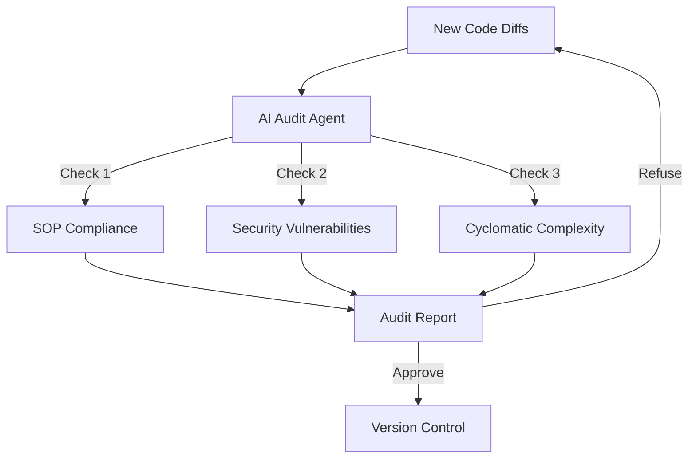

# BK-01: Automated Review Workflows

> [!NOTE]
> This documentation follows the **PPM V4 Gold Standard**.

## 🔗 1. Source Link
- [AI-powered Code Reviews](https://www.codacy.com/blog/ai-code-review/)
- [GitHub Actions for AI Audit](https://github.com/features/actions)

## 📖 2. Brief & Detailed Explanation
### Brief
Membangun jalur audit otomatis di mana AI melakukan pengecekan kualitas pada setiap baris kode baru sebelum di-commit.

### Detailed
**Automated Review** bukan hanya linter statis. Ini adalah agen AI yang membaca perubahan (diffs) dan memberikan komentar layaknya manusia di Pull Request. Agen ini mengecek apakah kode mematuhi Standar Gold Standard, apakah ada potensi kebocoran memori, atau apakah ada implementasi fungsi yang redundan dengan yang sudah ada di repositori.

## 💡 3. Analogy
Memiliki **Editor Koran** pribadi. Setiap kali Anda menulis artikel (Kode), sang editor akan segera mencoret bagian yang tidak efisien atau yang tata bahasanya salah sebelum artikel tersebut dicetak (Merge).

## 📊 4. Mermaid Diagram

## ⚙️ 5. Under-the-hood Mechanics
Mekanisme pengiriman snippet file yang berubah ke API LLM disertai dengan "Checklist Konstitusi" dari `.cursorrules`.

## 🧪 6. Practical Lab
Menjalankan audit mandiri pada modul yang baru dibuat di `./examples/07-auto-audit.md`.

## ⚠️ 7. Pitfalls & Anti-Patterns
- **Ignoring Warnings**: Menganggap audit AI sebagai "noise" dan mengabaikan saran perbaikannya.
- **False Sense of Security**: Mengandalkan audit AI sepenuhnya tanpa melakukan review manual sama sekali.
