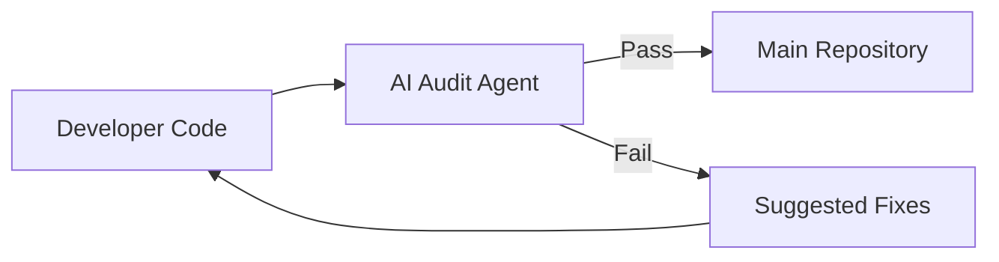

# CH-01: Automated Audit Workflows

## 📖 1. Continuous Governance
Audit otomatis memastikan bahwa setiap perubahan kode tetap mematuhi SOP tanpa harus menunggu review manual yang lambat.

## ⚙️ 2. Implementation with AI
- **Pre-commit Audit**: AI melakukan scanning pada diffs sebelum commit.
- **Rule-based Scoring**: Memberikan skor 1-10 pada kode berdasarkan kepatuhan terhadap `.cursorrules`.
- **Auto-Fixing**: AI secara otomatis memperbaiki pelanggaran minor (seperti indentasi atau penamaan).

## 📊 3. Audit Gate

## 🚀 4. Benefit
Mengurangi beban kognitif pengembang senior karena AI sudah menyaring kesalahan-kesalahan dasar dan gaya penulisan di awal.
