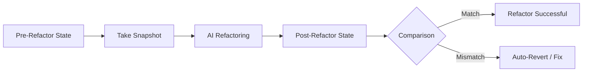

# BK-02: Refactoring Guardrails

> [!NOTE]
> This documentation follows the **PPM V4 Gold Standard**.

## 🔗 1. Source Link
- [Refactoring without Regressions](https://refactoring.com/)
- [Snapshot Testing Strategies](https://jestjs.io/docs/snapshot-testing)

## 📖 2. Brief & Detailed Explanation
### Brief
Metode pengamanan khusus saat melakukan perubahan besar pada struktur kode yang sudah stabil.

### Detailed
Refactoring dengan AI sangat cepat, tapi juga sangat berisiko. **Guardrails** (Pagar Pembatas) adalah teknik di mana kita menginstruksikan AI untuk: 1. Melakukan snapshot pada output saat ini. 2. Melakukan perubahan kode. 3. Memverifikasi bahwa output setelah perubahan tetap identik (atau sesuai harapan). Ini menjamin fungsionalitas aplikasi tidak hancur saat kita membersihkan kode.

## 💡 3. Analogy
Seperti **mengganti ban mobil saat mobil sedang melaju**. Anda membutuhkan sistem dongkrak otomatis (Guardrails) yang memastikan mobil tidak jatuh ke aspal saat ban lama dilepas dan ban baru dipasang.

## 📊 4. Mermaid Diagram

## ⚙️ 5. Under-the-hood Mechanics
Penggunaan unit test yang bersifat *Regression-focused* dan bagaimana agen memantau log perubahan status test selama proses refactoring.

## 🧪 6. Practical Lab
Latihan refactoring fitur lama dengan guardrails ketat di `./examples/07-safe-refactor.md`.

## ⚠️ 7. Pitfalls & Anti-Patterns
- **Blind Refactoring**: Mengubah struktur file besar tanpa memiliki test suite yang memadai.
- **Refactor Bloat**: Mencoba mengubah terlalu banyak hal dalam satu kali eksekusi, sehingga sulit dilacak di mana letak kerusakannya jika terjadi error.
