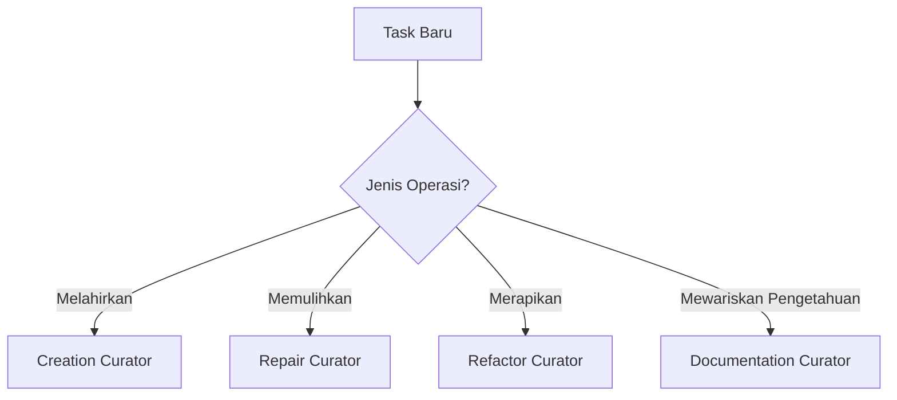

# SR-03: Curator Workflows

Sub-rak ini membahas cara memilih **kurator workflow** yang tepat sesuai jenis operasi terhadap proyek. Bukan semua task harus diperlakukan sama: membangun sesuatu yang baru, memperbaiki bug, merapikan struktur, dan mendokumentasikan hasil kerja membutuhkan toolkit mode AI yang berbeda.

---

## Gampangnya...

Kalau AI itu seperti teknisi, maka kurator adalah **kotak alat** yang kamu pilih sebelum bekerja. Saat mau membangun rumah baru, alatnya beda dengan saat memperbaiki atap bocor. Saat mau rapikan gudang, alatnya juga beda lagi.

Di sinilah kita mengelompokkan workflow AI menjadi empat kelas utama:
- **Creation** untuk melahirkan sesuatu yang baru
- **Repair** untuk memulihkan yang rusak
- **Refactor** untuk membenahi tanpa mengubah perilaku inti
- **Documentation** untuk menangkap hasil kerja menjadi pengetahuan yang bisa diwariskan

---

## Konteks & Sejarah

Masalah umum dalam kerja bareng AI adalah semua task diperlakukan seolah-olah sama. Akibatnya:
- task pembuatan proyek baru diperlakukan seperti bugfix,
- bugfix melebar jadi refactor liar,
- refactor dilakukan tanpa pembatas perilaku,
- dokumentasi selalu tertinggal di belakang.

Konsep **Curator Workflows** lahir untuk memaksa kita memilih pendekatan berdasarkan jenis kerja, bukan sekadar berdasarkan mood atau spontanitas AI.

---

## Cara Kerja

### Peta 4 Kurator Utama



### Peta Mode AI per Kurator

| Kurator | Fokus | Mode Utama |
|---|---|---|
| **Creation** | Membangun hal baru | `DISCUSS`, `BLUEPRINT`, `PLAN`, `ANALYZE`, `EXECUTE`, `REVIEW` |
| **Repair** | Memperbaiki yang rusak | `DISCUSS`, `ANALYZE`, `DEBUG`, `TEST`, `EXECUTE`, `REVIEW` |
| **Refactor** | Merapikan tanpa ubah behavior | `DISCUSS`, `ANALYZE`, `REFACTOR`, `TEST`, `REVIEW`, `DOCUMENT` |
| **Documentation** | Mengarsipkan hasil dan keputusan | `DISCUSS`, `ANALYZE`, `DOCUMENT`, `REVIEW` |

---

## Kapan Digunakan

Gunakan sub-rak ini saat kamu bingung menjawab pertanyaan seperti:
- "Task ini sebenarnya masuk pembuatan baru atau perbaikan?"
- "Saya butuh blueprint dulu atau langsung debug?"
- "Ini bugfix, refactor, atau sebenarnya cuma dokumentasi?"
- "Mode AI apa yang wajib dan mana yang hanya pendukung?"

Aturan cepatnya:
- kalau tujuannya **menciptakan**, masuk ke `BK-01`
- kalau tujuannya **memperbaiki**, masuk ke `BK-02`
- kalau tujuannya **merapikan**, masuk ke `BK-03`
- kalau tujuannya **mencatat dan menyerahkan**, masuk ke `BK-04`

---

## Cara Pakai

### Template Klasifikasi Task

```text
"Sebelum mulai, klasifikasikan task ini:
apakah ini Creation, Repair, Refactor, atau Documentation?
Jelaskan alasannya dalam 3 poin dan sebutkan mode AI apa yang paling relevan."
```

### Checklist Awal

1. Apa tujuan utama task ini?
2. Apakah kita sedang melahirkan sesuatu, memulihkan sesuatu, merapikan sesuatu, atau menangkap pengetahuan?
3. Jika task ini campuran, kurator primer-nya yang mana?

### Aturan Kurator Primer

Jika satu task punya dua wajah, pilih kurator berdasarkan **tujuan dominan**.

Contoh:
- bikin fitur baru lalu dokumentasikan -> primer `Creation`
- perbaiki bug lalu rapikan sedikit -> primer `Repair`
- refactor besar lalu update README -> primer `Refactor`

### Aturan Handover Antar Kurator

- `Creation` menyerahkan ke `Documentation` saat struktur baru sudah stabil dan perlu diwariskan.
- `Repair` menyerahkan ke `Refactor` hanya jika bug sudah pulih dan memang ada hutang struktur yang ingin dibenahi.
- `Refactor` menyerahkan ke `Documentation` saat struktur baru perlu dijelaskan ke sesi berikutnya.
- Jika sebuah task berubah tujuan di tengah jalan, klasifikasikan ulang dan pindahkan kurator primer secara sadar.

---

## Lab Praktek

**Skenario 1: Website baru**

Task: "Saya ingin membuat landing page baru dari nol."

Klasifikasi:
- `Creation Curator`

Karena fokusnya adalah melahirkan struktur dan flow baru.

**Skenario 2: Login sering gagal**

Task: "Kenapa login error saat traffic tinggi?"

Klasifikasi:
- `Repair Curator`

Karena fokusnya memulihkan perilaku yang rusak.

**Skenario 3: Struktur folder berantakan**

Task: "Rapikan folder feature ini tanpa mengubah behavior."

Klasifikasi:
- `Refactor Curator`

**Skenario 4: Tutup sesi kerja**

Task: "Ringkas semua perubahan hari ini untuk sesi berikutnya."

Klasifikasi:
- `Documentation Curator`

---

## Jebakan & Solusi

| Jebakan | Gejala | Solusi |
|---|---|---|
| **Salah pilih kurator** | AI melakukan workflow yang tidak cocok | Klasifikasikan task di awal sebelum mode lain aktif |
| **Creation diseret jadi repair** | Task baru malah sibuk diagnosis hal yang belum ada | Kembali ke tujuan utama task |
| **Repair melebar jadi refactor** | Bugfix berubah jadi bongkar total | Batasi scope dan fokus pada pemulihan |
| **Refactor diam-diam ubah behavior** | Hasil "lebih rapi" tapi perilakunya berubah | Wajib tentukan apa yang tidak boleh berubah |
| **Dokumentasi ditinggal** | Pengetahuan sesi hilang | Tutup semua workflow besar dengan `Documentation` |

---

## Buku Utama

- [BK-01: Kurator untuk Project Baru](./BK-01-Kurator-untuk-Project-Baru/README.md)
- [BK-02: Kurator untuk Perbaikan dan Bugfix](./BK-02-Kurator-untuk-Perbaikan-dan-Bugfix/README.md)
- [BK-03: Kurator untuk Refactor dan Pembenahan](./BK-03-Kurator-untuk-Refactor-dan-Pembenahan/README.md)
- [BK-04: Kurator untuk Dokumentasi dan Handover](./BK-04-Kurator-untuk-Dokumentasi-dan-Handover/README.md)
