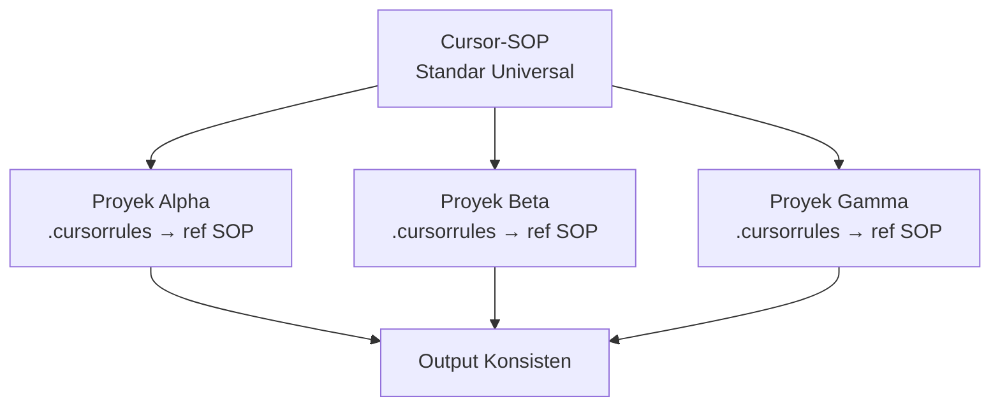

# RAK-08: Matrix Intersection — Konsistensi Lintas Proyek

## 🌟 Gampangnya...

Pernahkah kamu punya banyak proyek dan tiap proyek rasanya punya "gaya" yang berbeda-beda — satu pakai camelCase, satu pakai snake_case, satu tidak ada dokumentasi sama sekali? RAK ini adalah tentang menyamakan standar itu. Seperti QA (Quality Assurance) di perusahaan besar: memastikan semua output AI di semua proyekmu terasa hasil dari satu tangan yang sama.

---

## 📖 Konteks & Sejarah

AI tidak punya "ingatan" antar proyek. Setiap proyek adalah dunia baru baginya. Tanpa standar lintas proyek yang didefinisikan, setiap proyek berkembang dengan "dialek" yang berbeda. **Matrix Intersection** adalah jembatan yang menyatukan semua proyek di bawah satu set aturan universal.

---

## ⚙️ Cara Kerja



Idenya: Cursor-SOP ini menjadi **standar pusat**. Setiap `.cursorrules` di proyekmu merujuk ke sini. Update standar di satu tempat → berlaku di semua proyek.

---

## 🗺️ Kapan Mode Ini Relevan

| Mode | Kapan Pakai |
|---|---|
| 🔬 **ANALYZE** | "Audit seluruh folklor ini, pastikan gaya penamaan konsisten" |
| ♻️ **REFACTOR** | "Normalisasi kode ini sesuai standar di Cursor-SOP" |
| 📝 **DOCUMENT** | "Dokumentasikan semua keputusan naming convention di proyek ini" |

---

## 🛠️ Cara Pakai

### Audit Konsistensi Lintas File

```
"Audit seluruh folder ini untuk:
 1. Konsistensi gaya penamaan (camelCase vs snake_case)
 2. Pola struktur folder yang tidak konsisten
 3. File atau kode yang sudah tidak dipakai (dead code)
 Buat laporan dalam format tabel."
```

### Cross-Project Sync (Saat Mulai Proyek Baru)

```
"Saya ingin proyek baru ini mengikuti standar yang sama dengan
 proyek sebelumnya. Baca @[proyek-lama]/.cursorrules 
 dan buat template .cursorrules untuk proyek baru ini."
```

### Spring Cleaning (Pembersihan Berkala)

```
"Lakukan analisis 'spring cleaning':
 1. Identifikasi semua TODO/FIXME yang tersisa
 2. Cari dependency yang sudah tidak dipakai di package.json
 3. Identifikasi file dengan nama yang membingungkan
 Jangan hapus apapun dulu, cukup buat daftarnya."
```

---

## 🧪 Lab Praktek

**Skenario: 3 Proyek, 3 Gaya Berbeda — Cara Menyatukan**

1. Pilih satu proyek sebagai "proyek referensi" (yang paling rapi)
2. Ketik: *"Read @proyek-referensi/.cursorrules dan identifikasi 5 standar utamanya"*
3. Ketik: *"Sekarang bandingkan dengan @proyek-berantakan/. Di mana inkonsistensi terbesar?"*
4. Buat action plan: *"Buat daftar 10 perbaikan prioritas tinggi untuk menyesuaikan proyek-berantakan ke standar proyek-referensi"*

---

## ⚠️ Jebakan & Solusi

| Jebakan | Gejala | Solusi |
|---|---|---|
| **Normalisasi berlebihan** | AI ingin ubah semua sekaligus | Batasi: "Buat daftar dulu, jangan ubah apapun" |
| **Standar yang bertabrakan** | Proyek A butuh snake_case, Proyek B camelCase | Izinkan override lokal selama ada alasan di `.cursorrules` |
| **Lupa update standar pusat** | SOP di sini outdated, proyek jalan sendiri | Jadwalkan review Cursor-SOP setiap bulan |

---

### 🗂️ Sub-Rak & Buku
- **SR-01: Cross-Project Standards**
  - BK-01: Universal Naming Convention Guide
  - BK-02: Template `.cursorrules` Lintas Proyek
- **SR-02: Maintenance Protocols**
  - BK-01: Spring Cleaning Playbook
  - BK-02: Technical Debt Tracking
