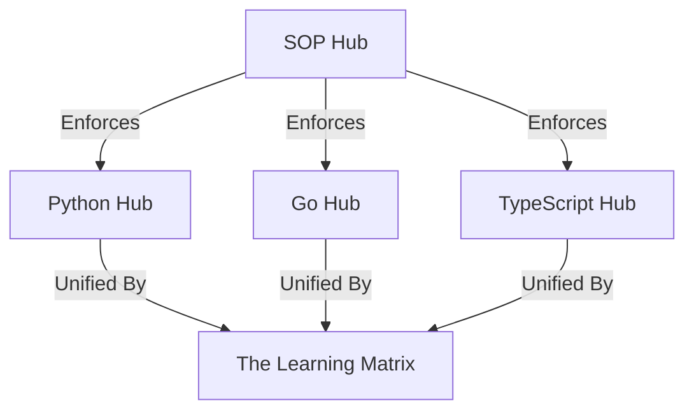

# RAK-08: Matrix Intersection

> [!NOTE]
> This documentation follows the **PPM V4 Gold Standard**.

## 🔗 1. Source Link
- [Cross-Language Design Patterns](https://refactoring.guru/design-patterns)

## 📖 2. Brief & Detailed Explanation
### Brief
Jembatan SOP: Memastikan konsistensi output di lintas bahasa (Sumbu-X & Sumbu-Y).

### Detailed
Bagaimana SOP ini menjamin bahwa kualitas dokumentasi di hub Python sama tingginya dengan di hub Rust atau TypeScript. Menghubungkan titik-titik di seluruh *The Learning Matrix* agar terjadi sinkronisasi standar teknis secara global.

## 💡 3. Analogy
Seperti standar colokan listrik internasional; di mana pun Anda berada (Bahasa apapun), alat Anda (SOP) akan tetap berfungsi dengan benar asalkan mengikuti standar yang sama.

## 📊 4. Mermaid Diagram

## ⚙️ 5. Under-the-hood Mechanics
Cross-repository linting dan sinkronisasi berkas `.cursorrules` secara otomatis menggunakan script.

## 🧪 6. Practical Lab
Sinkronisasi lintas hub di `./examples/08-matrix-sync.md`.

## ⚠️ 7. Pitfalls & Anti-Patterns
- **Fragmented Standards**: Mengizinkan satu hub memiliki standar yang lebih rendah dari yang lain.
- **Isolated Hubs**: Bekerja di satu bahasa tanpa mempertimbangkan pola arsitektur global repositori.

## 🏛️ 8. Granular Structure (The Taxonomy)

### [SR-01: Multi-Language Support](./SR-01-Multi-Language-Support/)
- [BK-01: Polyglot AI Coding](./SR-01-Multi-Language-Support/BK-01-Polyglot-AI-Coding/README.md)
- [BK-02: Universal Naming Conventions](./SR-01-Multi-Language-Support/BK-02-Universal-Naming-Conventions/README.md)

### [SR-02: System Interoperability](./SR-02-System-Interoperability/)
- [BK-01: Project Migration SOP](./SR-02-System-Interoperability/BK-01-Project-Migration-SOP/README.md)
- [BK-02: Final Integrity Check](./SR-02-System-Interoperability/BK-02-Final-Integrity-Check/README.md)

---

> [!TIP]
> Selamat! Anda telah menyelesaikan seluruh fundamental dari 8-Rak Universal Architecture. Masa depan AI Orchestration ada di tangan Anda.
