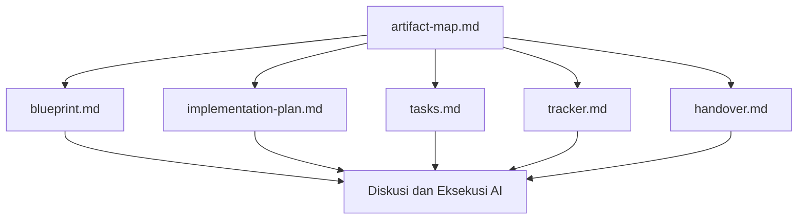

# BK-03: Template `artifact-map.md` untuk Artifact Governance

## Gampangnya...

Kalau kamu memakai banyak artefak seperti `blueprint.md`, `implementation-plan.md`, `tasks.md`, `tracker.md`, dan `handover.md`, lama-lama muncul masalah baru: file-nya ada, tapi AI dan user bingung file mana yang paling penting dibaca lebih dulu.

Di situlah `artifact-map.md` berguna. Anggap saja file ini sebagai **peta sumber kebenaran**. Bukan tempat menyimpan semua isi kerja, tetapi tempat yang menjelaskan:
- file mana yang authoritative,
- mana checklist utama,
- mana panel status,
- dan bagaimana AI harus membaca semuanya tanpa bentrok.

> Catatan penting
> `artifact-map.md` di buku ini adalah **konvensi kerja**, bukan fitur native resmi ChatGPT atau Gemini.
> Kamu boleh memakainya sebagai file panduan lintas-tool agar workflow lebih stabil.

---

## Konteks & Sejarah

Begitu workflow AI mulai memakai banyak dokumen bantu, user sering masuk ke jebakan baru:
- semua file terasa sama penting,
- task aktif tidak jelas,
- diskusi bercampur dengan laporan,
- dan AI membaca dokumen secara liar tergantung apa yang paling dekat di konteks.

Masalah ini muncul baik di ChatGPT Projects maupun di lingkungan seperti Gemini/Antigravity. Bedanya hanya tempat memorinya:
- ChatGPT cenderung mengandalkan chat history, project memory, dan files,
- Gemini atau platform lain sering terasa bergantung ke context terakhir dan artefak yang sedang aktif.

Karena itu, dibutuhkan satu file kecil yang perannya bukan menjelaskan seluruh proyek, tetapi **menertibkan cara membaca artefak kerja**. `artifact-map.md` adalah jawaban praktis untuk masalah itu.

---

## Cara Kerja

### Fungsi `artifact-map.md`

`artifact-map.md` sebaiknya dipakai untuk 4 hal:

1. Menetapkan file authoritative
2. Menetapkan urutan baca artefak
3. Menetapkan aturan konflik jika file tidak sinkron
4. Menetapkan perbedaan perilaku per tool

### Apa yang Tidak Boleh Dilakukan

Jangan gunakan `artifact-map.md` untuk:
- menggantikan `blueprint.md`,
- menjadi tempat checklist task,
- menyimpan detail progres harian,
- menulis seluruh handover,
- menampung semua isi diskusi.

Artinya:
`artifact-map.md` adalah **index of truth**, bukan gudang semua kebenaran.

### Posisi `artifact-map.md` di Workflow



### Hierarki yang Disarankan

| Artefak | Fungsi | Checklist |
|---|---|---|
| `artifact-map.md` | peta sumber kebenaran | tidak |
| `blueprint.md` | arah solusi | tidak |
| `implementation-plan.md` | urutan fase | tidak |
| `tasks.md` | checklist eksekusi | ya |
| `tracker.md` | status aktif | tidak |
| `handover.md` | ringkasan akhir sesi | tidak |

---

## Kapan Digunakan

Gunakan `artifact-map.md` ketika:
- kamu memakai lebih dari satu artefak kerja,
- kamu pindah-pindah antara ChatGPT, Gemini, atau tool lain,
- AI sering tidak tahu mana dokumen yang paling authoritative,
- task aktif, hasil diskusi, dan handover mulai bercampur,
- kamu ingin satu file kecil yang bisa dibaca cepat di awal sesi.

Jangan pakai `artifact-map.md` untuk task receh yang hanya hidup satu sesi dan tidak punya artefak tambahan.

---

## Cara Pakai

### Prinsip Dasar

- buat `artifact-map.md` sesingkat mungkin,
- isinya aturan membaca, bukan isi proyek secara lengkap,
- jadikan dia pintu masuk awal sebelum AI membaca file lain,
- update hanya saat struktur artefak berubah.

### Template Umum

```text
# artifact-map.md

## Purpose
File ini adalah peta sumber kebenaran workflow.

## Authoritative Files
- blueprint.md: arah solusi
- implementation-plan.md: urutan fase
- tasks.md: checklist utama
- tracker.md: status aktif saat ini
- handover.md: ringkasan akhir sesi

## Reading Order
1. artifact-map.md
2. tracker.md
3. tasks.md
4. implementation-plan.md
5. blueprint.md
6. handover.md jika perlu konteks sesi sebelumnya

## Conflict Rules
- Jika tracker.md dan tasks.md bentrok, cek tracker.md dulu lalu laporkan mismatch.
- Jika tasks.md dan implementation-plan.md bentrok, jangan improvisasi; masuk ke ANALYZE.
- Jangan gunakan handover.md untuk menentukan active task.

## Checklist Rules
- Hanya tasks.md yang boleh memakai checkbox.
- implementation-plan.md tidak boleh menjadi checklist harian.
- tracker.md adalah panel status, bukan daftar task.

## Tool Notes
- ChatGPT: gunakan file ini di Project dan rujuk sebelum melanjutkan sesi.
- Gemini/Antigravity: baca file ini sebelum membaca artefak lain agar tidak salah urutan.
```

### Template yang Lebih Tajam untuk ChatGPT dan Gemini

```text
# artifact-map.md

## Workflow Mode
Artifact Governance

## Primary Rule
Jangan jadikan chat history atau context terakhir sebagai satu-satunya sumber status.

## Source of Truth
- blueprint.md = shape
- implementation-plan.md = sequence
- tasks.md = actionable checklist
- tracker.md = current truth
- handover.md = end-of-session summary

## Read First
1. artifact-map.md
2. tracker.md
3. tasks.md

## Read As Needed
4. implementation-plan.md
5. blueprint.md
6. handover.md

## Execution Rules
- Kerjakan hanya active task yang selaras dengan tracker.md.
- Setelah satu loop selesai, update tasks.md dan tracker.md.
- Jika ada mismatch, berhenti dan jelaskan konflik.

## ChatGPT Notes
- Jika memakai Projects, simpan file ini bersama artefak kerja lain.
- Gunakan project instructions untuk mengingatkan AI agar mematuhi file ini.

## Gemini Notes
- Gunakan file ini sebagai anchor di awal sesi agar model cepat tidak loncat langkah.
- Jangan biarkan implementation plan dan tasks sama-sama menjadi checklist.
```

### Prompt untuk Memakai `artifact-map.md`

```text
Baca artifact-map.md dulu.
Setelah itu, baca tracker.md dan tasks.md.
Gunakan file-file tersebut sebagai sumber status utama.
Jika ada konflik dengan chat history atau konteks sebelumnya,
laporkan mismatch-nya dulu sebelum lanjut.
```

---

## Lab Praktek

**Skenario: ChatGPT dan Gemini memakai struktur artefak yang sama**

Kamu punya:
- `blueprint.md`
- `implementation-plan.md`
- `tasks.md`
- `tracker.md`
- `handover.md`

Tanpa `artifact-map.md`, gejala yang sering muncul:
- ChatGPT membaca obrolan lama lalu mengabaikan tracker,
- Gemini fokus ke task terakhir yang terlihat dan melompat fase,
- user sendiri bingung file mana yang harus dibuka lebih dulu.

Dengan `artifact-map.md`, alurnya menjadi lebih rapi:

1. AI baca `artifact-map.md`,
2. AI baca `tracker.md`,
3. AI baca `tasks.md`,
4. baru AI lanjut ke plan atau blueprint jika dibutuhkan.

Hasilnya:
- sumber kebenaran lebih jelas,
- lintas-tool jadi lebih konsisten,
- dan user tidak perlu mengulang penjelasan struktur kerja di setiap sesi.

---

## Jebakan & Solusi

| Jebakan | Gejala | Solusi |
|---|---|---|
| **`artifact-map.md` terlalu panjang** | AI bingung karena file pengarah malah jadi dokumen besar | Batasi ke aturan membaca dan hirarki |
| **`artifact-map.md` berisi semua isi proyek** | Fungsinya tumpang tindih dengan blueprint dan plan | Jadikan dia peta, bukan gudang |
| **Tidak ada aturan konflik** | AI improvisasi saat file bentrok | Tuliskan conflict rules secara eksplisit |
| **Tracker tetap diabaikan** | AI kembali mengikuti chat terakhir | Paksa reading order dimulai dari `artifact-map.md` lalu `tracker.md` |
| **Local override tidak dicatat** | ChatGPT dan Gemini berperilaku beda tanpa alasan jelas | Tambahkan `Tool Notes` atau override lokal secukupnya |

---

## Materi Sebelumnya

- [BK-01: Centralized SOP Management](../BK-01-Centralized-SOP-Management/README.md)
- [BK-02: Sync Protocols](../BK-02-Sync-Protocols/README.md)


