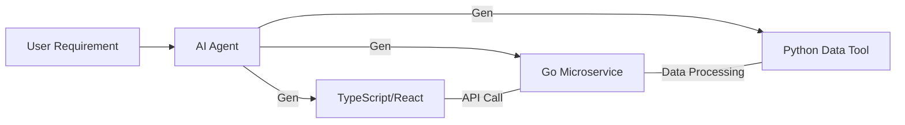

# BK-01: Polyglot AI Coding

> [!NOTE]
> This documentation follows the **PPM V4 Gold Standard**.

## 🔗 1. Source Link
- [The Rise of Polyglot Programming](https://martinfowler.com/bliki/PolyglotProgramming.html)
- [Working with Multiple Languages in Cursor](https://docs.cursor.com/features/multi-language)

## 📖 2. Brief & Detailed Explanation
### Brief
Strategi menggunakan AI untuk mengelola basis kode yang menggunakan berbagai bahasa pemrograman secara harmonis.

### Detailed
Proyek modern sering kali menggabungkan berbagai bahasa (misal: Frontend JS, Backend Go, dan Scripting Python). **Polyglot AI Coding** adalah teknik di mana kita memberikan konteks lintas bahasa kepada AI. Dengan memahami bagaimana modul dalam satu bahasa berinteraksi dengan modul di bahasa lain (melalui API, RPC, atau FFI), AI dapat membantu melakukan debugging lintas tumpukan teknologi tanpa kehilangan konteks arsitektural.

## 💡 3. Analogy
Seperti memiliki **Penerjemah Universal** di sebuah konferensi internasional. Sang penerjemah tidak hanya tahu bahasa masing-masing peserta, tapi juga tahu bagaimana ide dari peserta Jerman (Backend) harus disampaikan ke peserta Jepang (Frontend) agar tidak salah paham.

## 📊 4. Mermaid Diagram

## ⚙️ 5. Under-the-hood Mechanics
Bagaimana LLM modern dilatih secara bersamaan pada ribuan bahasa pemrograman, yang memungkinkan mereka melakukan *Cross-lingual Reasoning* (misal: menerapkan pola desain dari Java ke Python secara akurat).

## 🧪 6. Practical Lab
Membangun integrasi sederhana antara skrip Python dan server Node.js dengan bantuan AI di `./examples/08-polyglot-setup.md`.

## ⚠️ 7. Pitfalls & Anti-Patterns
- **Syntax Contamination**: AI menulis kode Python dengan gaya penulisan Java (misal: menggunakan camelCase berlebihan di Python).
- **Broken Bridges**: AI memperbaiki satu sisi (misal: API di Backend) tapi lupa memperbarui sisi lainnya (misal: Client call di Frontend), menyebabkan sistem hancur di bagian sambungannya.
