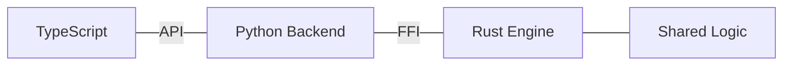

# CH-01: Multi-lang Interop

## 📖 1. The Polyglot Reality
Proyek modern sering menggabungkan Rust untuk performa, Python untuk AI/Data, dan TypeScript untuk UI. Tantangannya adalah menjaga logika tetap sinkron di seluruh bahasa ini.

## ⚙️ 2. Interoperability Patterns
- **FFI (Foreign Function Interface)**: Memanggil fungsi Rust langsung dari Python atau Node.js.
- **Shared Schemas**: Menggunakan Protobuf atau JSON Schema agar tipe data konsisten di semua bahasa.
- **Unified CI**: Testing yang memvalidasi integrasi lintas bahasa secara otomatis.

## 📊 3. Connectivity

## ⚠️ 4. Pitfalls
Halusinasi tipe data saat berpindah dari bahasa bertipe statis (Rust) ke dinamis (Python). Selalu gunakan @codebase untuk memberikan konteks kedua sisi jembatan pada AI.
