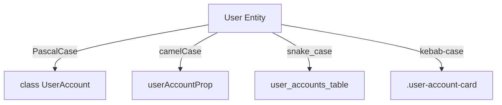

# BK-02: Universal Naming Conventions

> [!NOTE]
> This documentation follows the **PPM V4 Gold Standard**.

## 🔗 1. Source Link
- [Google Style Guides for Multiple Languages](https://google.github.io/styleguide/)
- [Microsoft Casing Conventions](https://learn.microsoft.com/en-us/dotnet/standard/design-guidelines/capitalization-conventions)

## 📖 2. Brief & Detailed Explanation
### Brief
Standarisasi penamaan variabel, fungsi, dan file agar tetap konsisten dan dapat dipahami AI meskipun berpindah-pindah bahasa pemrograman.

### Detailed
Konsistensi adalah teman terbaik AI. Jika Anda menamakan variabel user sebagai `usr_id` di database, `userId` di API, dan `UserIdentifier` di UI, AI akan bingung. **Universal Naming Conventions** mewajibkan penggunaan skema penamaan yang transparan dan dapat dipetakan secara logis antar bahasa. Ini meminimalisir halusinasi AI saat melakukan pemetaan data (data mapping) antar layer aplikasi.

## 💡 3. Analogy
Seperti **Rambu Lalu Lintas Internasional**. Di negara mana pun Anda berada, tanda "STOP" selalu berwarna merah dan berbentuk segi delapan. Konsistensi visual ini membuat semua pengendara (AI/Manusia) langsung paham tanpa perlu membaca manual setiap kali pindah negara.

## 📊 4. Mermaid Diagram

## ⚙️ 5. Under-the-hood Mechanics
Menjelaskan teknik *Contextual Grounding*: Memberikan kamus istilah (glossary) ke AI dalam `.cursorrules` agar ia selalu menggunakan istilah yang sama untuk entitas yang sama.

## 🧪 6. Practical Lab
Audit penamaan lintas file menggunakan regex dan bantuan AI di `./examples/08-naming-audit.md`.

## ⚠️ 7. Pitfalls & Anti-Patterns
- **Acronym Overload**: Menggunakan singkatan yang tidak umum (seperti `ctx`, `svc`, `mgr`) yang maknanya bisa berbeda-beda tergantung bahasa atau framework.
- **Language-specific Bias**: Memaksakan satu gaya bahasa (misal: Pythonic naming) ke dalam ekosistem bahasa lain (misal: Rust) yang memiliki standar komunitas yang sangat berbeda.
