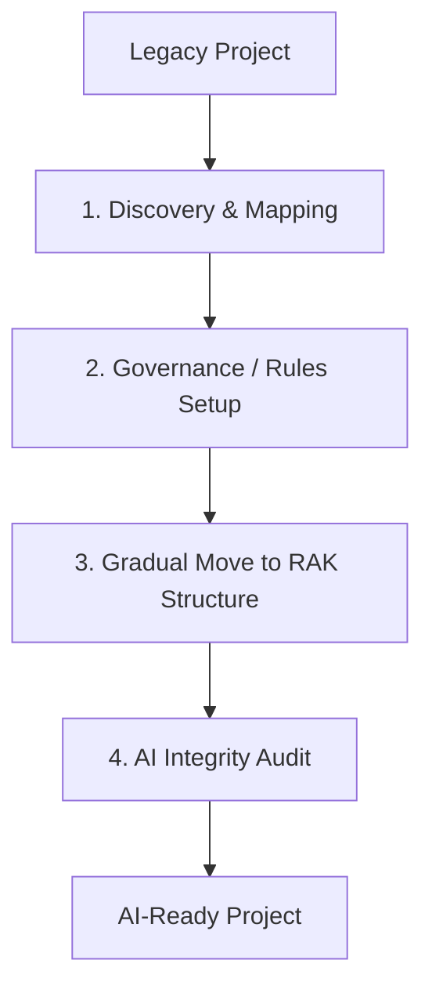

# BK-01: Project Migration SOP

> [!NOTE]
> This documentation follows the **PPM V4 Gold Standard**.

## 🔗 1. Source Link
- [Legacy Systems Migration Strategies](https://martinfowler.com/articles/strangler-fig-application.html)
- [Migrating to Mono-repo Architectures](https://monorepo.tools/)

## 📖 2. Brief & Detailed Explanation
### Brief
Prosedur standar untuk memindahkan proyek tradisional ke dalam format AI-native (seperti struktur 8-Rak).

### Detailed
Migrasi proyek tidak boleh dilakukan secara acak. **Project Migration SOP** mengikuti langkah: 1. **Discovery** (Pemetaan struktur lama). 2. **Contextualization** (Penambahan `.cursorrules` dan README). 3. **Modularization** (Pecah kode menjadi RAK-RAK yang logis). 4. **Verification** (Uji integritas). Hal ini memastikan AI memiliki visibilitas penuh terhadap "sejarah" kode lama saat membangun fitur baru di struktur yang baru.

## 💡 3. Analogy
Seperti **memindahkan perpustakaan tua ke gedung baru yang digital**. Anda tidak bisa asal lempar buku; Anda harus mengindeks semua judul, membersihkan debunya, dan menaruhnya di rak yang tepat agar pengunjung (AI) bisa menemukannya dengan cepat.

## 📊 4. Mermaid Diagram

## ⚙️ 5. Under-the-hood Mechanics
Teknik *Strangler Fig* untuk mengganti bagian-bagian kecil dari sistem lama secara bertahap menggunakan bantuan saran refactoring dari AI.

## 🧪 6. Practical Lab
Latihan migrasi repositori "Hello World" ke format 8-Rak di `./examples/08-migration-lab.md`.

## ⚠️ 7. Pitfalls & Anti-Patterns
- **Big Bang Migration**: Mencoba memindah seluruh file sekaligus dalam satu commit, yang hampir selalu berujung pada kerusakan dependensi.
- **Documentation Debt**: Memindah kode tapi tidak memindah atau memperbarui dokumentasi teknisnya, membuat AI kehilangan arah.
