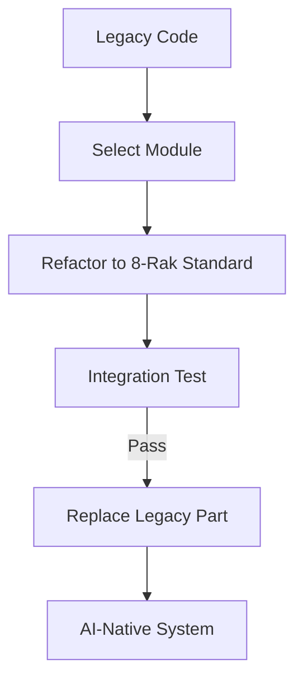

# CH-01: Migration Strategy (Strangler Fig)

## 📖 1. Safe Modernization
Memindahkan sistem lama ke arsitektur agentic-ready (seperti 8-Rak) tidak boleh dilakukan sekaligus. Kita menggunakan pola **Strangler Fig**.

## ⚙️ 2. Step-by-Step Migration
1. **Identify**: Tentukan modul terkecil yang akan dipindah.
2. **Standardize**: Terapkan standar PPM V4 pada dokumen modul tersebut.
3. **Bridge**: Hubungkan modul baru dengan sistem lama melalui interface yang stabil.
4. **Strangle**: Hapus kode lama setelah modul baru terbukti stabil.

## 📊 3. Migration Flow

## 🚀 4. Result
Migrasi bertahap mengurangi risiko downtime dan kebingungan AI karena ia bisa mempelajari sistem lama sambil membangun sistem baru secara paralel.
