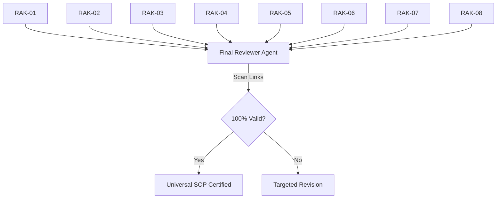

# BK-02: Final Integrity Check

> [!NOTE]
> This documentation follows the **PPM V4 Gold Standard**.

## 🔗 1. Source Link
- [System Theory: Integrity and Cohesion](https://en.wikipedia.org/wiki/System_integrity)
- [Verification and Validation (V&V)](https://www.nasa.gov/seh/5-3-product-verification)

## 📖 2. Brief & Detailed Explanation
### Brief
Audit terakhir untuk memastikan bahwa seluruh 8 Rak dalam repositori ini saling terhubung, konsisten, dan berfungsi sesuai SOP yang telah ditetapkan.

### Detailed
**Final Integrity Check** adalah langkah penutup di mana kita melakukan evaluasi menyeluruh. Apakah tautan (links) antar Rak berfungsi? Apakah standar PPM V4 benar-benar diterapkan di semua buku? Apakah protokol DISCUSS vs EXECUTE dipatuhi? Ini adalah titik di mana sistem koding agen dinyatakan "Lulus Sertifikasi" dan siap digunakan untuk produksi skala besar.

## 💡 3. Analogy
Seperti **Inspeksi Akhir** sebelum peluncuran roket. Semua sensor (Rak) diperiksa satu per satu untuk memastikan tidak ada baut yang longgar. Jika satu sensor gagal, peluncuran ditunda hingga semuanya sempurna.

## 📊 4. Mermaid Diagram

## ⚙️ 5. Under-the-hood Mechanics
Penggunaan skrip otomatis untuk melakukan *Link Checking* lintas direktori dan scanning kata kunci wajib Gold Standard di seluruh file `.md`.

## 🧪 6. Practical Lab
Menjalankan skrip "Integrity Scanner" sederhana di `./examples/08-final-check.md`.

## ⚠️ 7. Pitfalls & Anti-Patterns
- **Complacency**: Menganggap karena sudah sampai RAK-08 maka semuanya pasti benar tanpa melakukan pengecekan ulang ke RAK-01.
- **Inconsistent Taxonomy**: Menemukan ada file yang tidak menggunakan format penamaan `BK-xx` atau `SR-xx` di menit-menit terakhir tapi dibiarkan saja.
