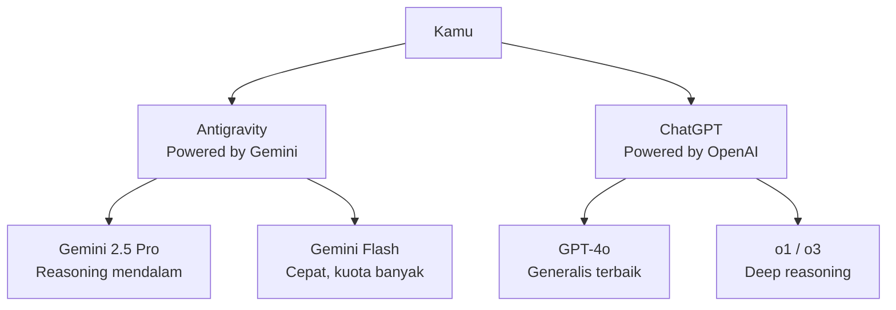

# RAK-09: AI Arsenal — Panduan Memilih & Memadukan Model AI

## 🌟 Gampangnya...

Kamu punya dua "senjata" AI premium: **Antigravity (Gemini)** dan **ChatGPT (OpenAI)**. Masalahnya, masing-masing model punya kekuatan berbeda, kuota terbatas, dan kelemahan yang tidak selalu jelas. Rak ini adalah **buku pegangan** agar kamu tidak pernah salah pilih model — dan agar kuotamu tidak habis sia-sia untuk task yang bisa dikerjakan oleh model yang lebih hemat.

---

## 📖 Konteks & Sejarah

Setiap model AI dilatih dengan fokus berbeda dan memiliki arsitektur yang berbeda. Gemini Pro unggul pada reasoning lintas konteks besar. Flash dirancang untuk kecepatan dan volume tinggi. Claude Sonnet kuat di nuansa bahasa dan code review. GPT-4o dan o1/o3 memiliki chain-of-thought reasoning yang mendalam. Mengetahui ini bukan sekedar trivia — ini langsung berdampak pada kecepatan dan kualitas kerjamu.

---

## ⚙️ Cara Kerja

### Arsitektur Platform yang Kamu Miliki



---

## 🗺️ Decision Matrix — Pakai Model Mana?

| Task | Platform | Model | Alasan |
|---|---|---|---|
| Analisis kode kompleks, arsitektur | Antigravity | **Gemini 2.5 Pro** | Context window besar + reasoning kuat |
| Generate kode cepat & iteratif | Antigravity | **Gemini Flash** | Cepat, cocok untuk iterasi banyak |
| Brainstorming, ideasi kreatif | ChatGPT | **GPT-4o** | Bahasa natural, kreatif, versatile |
| Debug masalah logika yang dalam | ChatGPT | **o1 / o3** | Chain-of-thought mendalam |
| Review kode & kualitas | Antigravity | **Gemini 2.5 Pro** | Konteks besar → bisa baca semua file terkait |
| Dokumentasi & penjelasan | Keduanya | **Flash / GPT-4o-mini** | Task tidak butuh reasoning berat |
| Refactoring besar | Antigravity | **Gemini 2.5 Pro** | Konteks semua file sekaligus |
| Task sederhana & rutin | Keduanya | **Model tercepat** | Hemat kuota Pro untuk yang perlu |

---

## 🛠️ Cara Pakai

### SR-05: Quota Blending Strategy

**Masalah**: Kuota Pro/Sonnet habis → terpaksa pakai Flash → performa turun.

#### Prinsip 1: Task Triage (Lakukan Sebelum Setiap Sesi)

```
Sebelum mulai, tanya ke diri sendiri:
❓ "Apakah task ini butuh reasoning mendalam?"
   → Ya (debug sulit, arsitektur, analisis) → WAJIB pakai Pro/Sonnet
   → Tidak (generate, format, dokumentasi) → Cukup Flash/GPT-4o-mini
```

#### Prinsip 2: Quota Budgeting

```
# Reservasi Pro/Gemini High untuk:
✅ BLUEPRINT & PLAN (sesi ini menentukan arah semua kerja berikutnya)
✅ ANALYZE & DEBUG (butuh reasoning dalam)
✅ REVIEW final (sebelum commit)

# Pakai Flash untuk:
✅ EXECUTE kode sederhana yang sudah ada blueprint-nya
✅ DOCUMENT & tulis komentar
✅ Task yang sudah jelas, tidak butuh keputusan baru
```

#### Prinsip 3: Flash Enhancement (Saat Terpaksa Pakai Flash)

Saat kuota Pro habis dan Flash harus mengerjakan task yang biasanya butuh Pro:

```
"Kerjakan ini step by step. Sebelum menulis kode:
 1. Ulangi pemahamanmu tentang task ini dalam 1 kalimat
 2. Identifikasi 2 risiko utama
 3. Baru mulai coding
 
 Ini adalah task [KATEGORI: complex/medium/simple]."
```

> Flash cenderung lebih baik saat kamu **memandu step-by-step**, bukan membiarkan dia memutuskan sendiri.

#### Prinsip 4: Cross-Platform Fallback

```
Hierarki fallback saat kuota habis:

Gemini Pro habis → Switch ke ChatGPT GPT-4o (bukan Flash)
ChatGPT o1 habis → Switch ke Gemini Pro (bukan Flash)
Keduanya habis high-tier → Pakai Flash DENGAN Flash Enhancement
```

#### Prinsip 5: Batching

```
# Kumpulkan semua pertanyaan kompleks dalam satu sesi Pro:

"Hari ini saya akan tanyakan TIGA hal sekaligus:
 1. [Arsitektur auth system]
 2. [Analisis bottleneck di endpoint X]
 3. [Review PRD fitur Y]
 Jawab satu per satu dengan detail."
```

---

## 🧪 Lab Praktek

**Skenario: Sprint sehari dengan kuota terbatas**

**Pagi (kuota masih penuh):**
```
Pakai Gemini 2.5 Pro:
"Blueprint semua task hari ini dalam satu sesi.
 Saya akan kerjakan: [list task].
 Untuk setiap task, buat rencana eksekusi singkat."
```

**Siang (eksekusi):**
```
Pakai Gemini Flash (sudah ada blueprint):
"Eksekusi blueprint yang tadi. Mulai dari task 1."
```

**Sore (review):**
```
Pakai ChatGPT GPT-4o (jika Pro sudah habis):
"Review semua yang sudah dikerjakan hari ini. 
 Cari inkonsistensi atau potensi bug."
```

---

## ⚠️ Jebakan & Solusi

| Jebakan | Gejala | Solusi |
|---|---|---|
| **Pakai Pro untuk semua task** | Kuota Pro habis di tengah hari | Identifikasi task yang cukup Flash sebelum mulai |
| **Fallback ke Flash tanpa perubahan cara** | Flash hasilnya jelek, kamu frustasi | Gunakan Flash Enhancement — Flash butuh guidance lebih eksplisit |
| **Ganti platform tanpa context transfer** | Model baru tidak tahu konteks sebelumnya | Selalu paste ringkasan konteks saat ganti platform |
| **o1/o3 untuk task cepat** | Kehabisan kuota o1 untuk task sederhana | o1/o3 khusus untuk reasoning mendalam — jangan buang untuk hal sederhana |

---

### 🗂️ Sub-Rak & Buku
- **SR-01: Model Decision Matrix**
  - [BK-01: Gemini vs ChatGPT](./SR-01-Model-Decision-Matrix/BK-01-Gemini-vs-ChatGPT/README.md)
  - [BK-02: High-vs-Low Tier](./SR-01-Model-Decision-Matrix/BK-02-High-vs-Low-Tier/README.md)
- **SR-02: Quota Blending Strategy**
  - [BK-01: Blended Workflows](./SR-02-Quota-Blending-Strategy/BK-01-Blended-Workflows/README.md)
  - [BK-02: Fallback Protocols](./SR-02-Quota-Blending-Strategy/BK-02-Fallback-Protocols/README.md)
