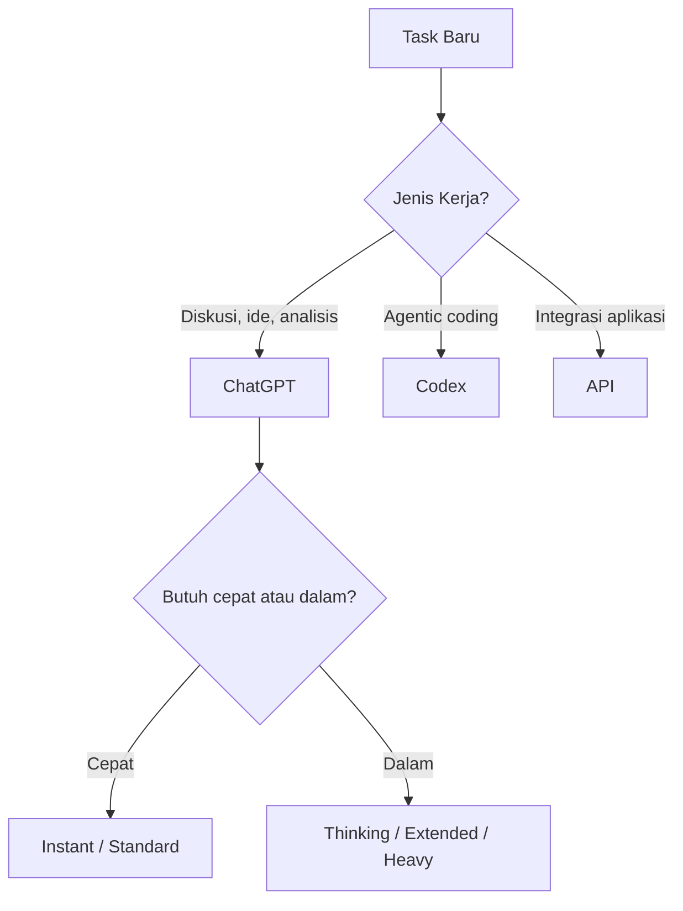

# RAK-09: AI Arsenal - Panduan Memilih Model, Mode, dan Alat AI

## Gampangnya...

Punya banyak model AI itu enak, tapi juga gampang bikin bingung. Salah pilih model bisa bikin kerja lambat, hasil dangkal, atau kuota habis untuk tugas yang sebenarnya ringan.

RAK ini adalah buku pegangan untuk memilih **alat yang tepat, model yang tepat, dan kedalaman reasoning yang tepat** sesuai jenis tugasmu.

> Status per 2026-03-28.
> Nama model, availability per plan, dan batas penggunaan adalah area yang cepat berubah.

---

## Konteks & Sejarah

Dulu banyak user hanya membagi model menjadi dua kubu: "yang pintar" dan "yang cepat". Sekarang kenyataannya jauh lebih kompleks:
- ada perbedaan antara chat product, coding agent, dan API,
- ada perbedaan antara model picker di UI dan model IDs teknis,
- ada selector thinking yang memengaruhi kedalaman reasoning,
- ada batas usage yang membuat strategi pemakaian menjadi penting.

Karena itu, memilih model hari ini bukan lagi soal hafal nama, tetapi soal memahami **routing kerja**.

---

## Cara Kerja

### Decision Flow Sederhana

### Prinsip Inti

| Prinsip | Maknanya |
|---|---|
| **Task Triage** | Bedakan task ringan, menengah, dan mahal |
| **Right Tool First** | ChatGPT, Codex, dan API punya konteks kerja berbeda |
| **Reasoning as Budget** | Thinking effort adalah biaya kedalaman berpikir |
| **Quota Discipline** | Simpan model dan mode termahal untuk tugas yang salahnya mahal |

---

## Kapan Digunakan

RAK ini relevan ketika kamu menghadapi pertanyaan seperti:
- "Saya sebaiknya pakai model cepat atau model thinking?"
- "Kapan cukup pakai ChatGPT, kapan pindah ke Codex?"
- "Bagaimana cara menghemat kuota mingguan tanpa menurunkan kualitas kerja?"
- "Apa bedanya model yang tampil di UI dengan model teknis di docs API?"

Kalau kebingunganmu ada di area pemilihan model, selector, platform, atau strategi kuota, mulai dari rak ini.

---

## Cara Pakai

### Ritual 3 Langkah Sebelum Memulai Sesi

1. Tentukan dulu jenis tugasmu:
   - drafting cepat,
   - debugging,
   - review,
   - coding agentic,
   - integrasi produk.
2. Tentukan dulu salahnya semahal apa:
   - murah jika salah,
   - sedang,
   - mahal jika salah.
3. Baru pilih:
   - alat,
   - model,
   - thinking level.

### Aturan Praktis

- Untuk tugas ringan: mulai dari opsi tercepat.
- Untuk tugas kompleks: naikkan model atau thinking effort.
- Untuk kerja repo nyata: jangan paksa chat biasa menjadi coding agent penuh.
- Untuk kuota mingguan: jangan jadikan mode terberat sebagai default.

### SR-02: Quota Blending Strategy

Gunakan sub-rak ini saat kamu perlu membagi beban kerja antara model cepat dan model reasoning dalam, tanpa membakar kuota mahal untuk semua hal.

### SR-03: ChatGPT Models and Usage

Gunakan sub-rak ini saat kamu ingin memahami:
- model yang relevan di ChatGPT,
- selector thinking,
- strategi kuota mingguan,
- dan batas antara ChatGPT, Codex, serta API.

### SR-04: Antigravity Model Optimization

Gunakan sub-rak ini saat kamu memakai platform multi-model seperti Antigravity dan perlu menjawab:
- model mana yang paling tepat untuk task tertentu,
- kapan harus memakai model premium dan kapan cukup model hemat,
- bagaimana membagi beban kerja agar kuota tidak cepat habis.

---

## Lab Praktek

**Skenario: satu hari kerja AI yang sehat**

Pagi:
- gunakan mode yang lebih dalam untuk blueprint, analisis inti, dan keputusan arah.

Siang:
- gunakan mode cepat untuk drafting, rewrite, dan iterasi.

Sore:
- gunakan model atau mode terbaik yang tersisa untuk audit final jika ada keputusan penting.

Pelajaran:
AI Arsenal bukan soal memakai model termahal terus-menerus, tapi soal **mengatur tenaga model seperti mengatur stamina tim**.

---

## Jebakan & Solusi

| Jebakan | Gejala | Solusi |
|---|---|---|
| **Model prestige trap** | Selalu memilih model paling berat | Gunakan task triage sebelum memilih |
| **Tool confusion** | ChatGPT dipaksa jadi coding agent penuh | Pindah ke Codex saat kerja repo nyata |
| **Quota panic** | Kuota habis untuk tugas receh | Simpan mode berat untuk keputusan mahal |
| **UI/API confusion** | Nama model di UI dan docs tercampur | Pelajari batas produknya di SR-03 |

---

### Sub-Rak & Buku
- **SR-01: Model Decision Matrix**
  - [BK-01: Gemini vs ChatGPT](./SR-01-Model-Decision-Matrix/BK-01-Gemini-vs-ChatGPT/README.md)
  - [BK-02: High-vs-Low Tier](./SR-01-Model-Decision-Matrix/BK-02-High-vs-Low-Tier/README.md)
- **SR-02: Quota Blending Strategy**
  - [BK-01: Blended Workflows](./SR-02-Quota-Blending-Strategy/BK-01-Blended-Workflows/README.md)
  - [BK-02: Fallback Protocols](./SR-02-Quota-Blending-Strategy/BK-02-Fallback-Protocols/README.md)
- **SR-03: ChatGPT Models and Usage**
  - [BK-01: ChatGPT Product Map](./SR-03-ChatGPT-Models-and-Usage/BK-01-ChatGPT-Product-Map/README.md)
  - [BK-02: ChatGPT Model Picker Guide](./SR-03-ChatGPT-Models-and-Usage/BK-02-ChatGPT-Model-Picker-Guide/README.md)
  - [BK-03: Thinking Selector Guide](./SR-03-ChatGPT-Models-and-Usage/BK-03-Thinking-Selector-Guide/README.md)
  - [BK-04: Weekly Quota and Usage Strategy](./SR-03-ChatGPT-Models-and-Usage/BK-04-Weekly-Quota-and-Usage-Strategy/README.md)
  - [BK-05: When to Use ChatGPT vs Codex vs API](./SR-03-ChatGPT-Models-and-Usage/BK-05-When-to-Use-ChatGPT-vs-Codex-vs-API/README.md)
- **SR-04: Antigravity Model Optimization**
  - [BK-01: Antigravity Model Landscape](./SR-04-Antigravity-Model-Optimization/BK-01-Antigravity-Model-Landscape/README.md)
  - [BK-02: Gemini Family in Antigravity](./SR-04-Antigravity-Model-Optimization/BK-02-Gemini-Family-in-Antigravity/README.md)
  - [BK-03: Claude Family in Antigravity](./SR-04-Antigravity-Model-Optimization/BK-03-Claude-Family-in-Antigravity/README.md)
  - [BK-04: GPT-OSS and Economy Models](./SR-04-Antigravity-Model-Optimization/BK-04-GPT-OSS-and-Economy-Models/README.md)
  - [BK-05: Quota Strategy and Task Routing](./SR-04-Antigravity-Model-Optimization/BK-05-Quota-Strategy-and-Task-Routing/README.md)
  - [BK-06: Playbook Pemilihan Model per Jenis Kerja](./SR-04-Antigravity-Model-Optimization/BK-06-Playbook-Pemilihan-Model-per-Jenis-Kerja/README.md)
