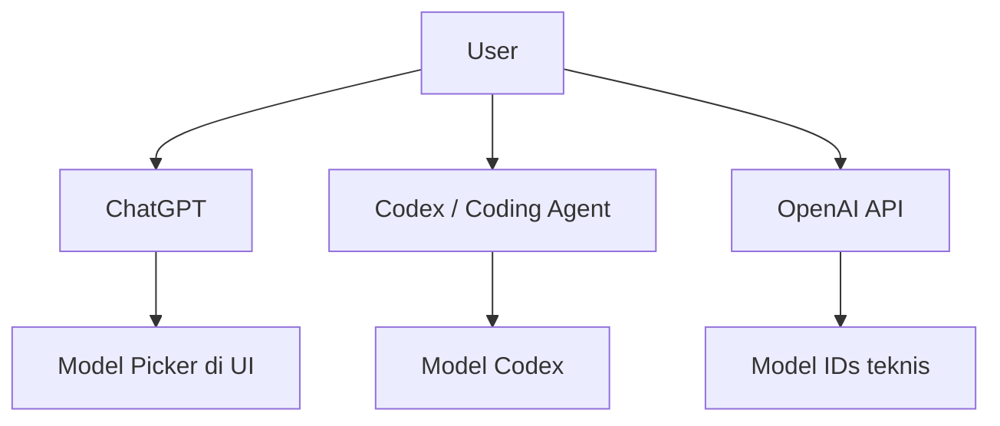

# BK-01: ChatGPT Product Map

## Gampangnya...

Banyak orang mengira ChatGPT itu cuma "daftar model". Padahal, ChatGPT adalah **produk kerja**, sedangkan model-model di baliknya hanyalah mesin yang dipilih atau dirutekan untuk tugas tertentu.

Kalau peta istilah ini tidak rapi dari awal, user akan bingung membedakan mana model yang benar-benar tampil di ChatGPT, mana nama teknis API, dan mana varian Codex untuk coding agent.

> Status per 2026-03-28.

---

## Konteks & Sejarah

Dulu user cukup berpikir sederhana: "pakai model A atau model B?" Sekarang ekosistem OpenAI jauh lebih bercabang:
- ChatGPT punya model picker dan mode otomatis,
- API punya model IDs teknis,
- Codex punya varian yang dioptimalkan untuk coding agent,
- reasoning effort bisa diatur terpisah dari nama model.

Karena itu, peta istilah menjadi langkah pertama sebelum bicara soal "model terbaik".

---

## Cara Kerja

### Peta Besar Produk

### Istilah Kunci

| Istilah | Artinya |
|---|---|
| **ChatGPT** | Produk chat siap pakai untuk user umum dan profesional |
| **Model Picker** | Pilihan model atau mode yang terlihat di UI ChatGPT |
| **Auto** | Mode yang merutekan ke pengalaman terbaik tanpa user memilih semuanya manual |
| **Thinking Selector** | Pengatur seberapa dalam model berpikir untuk satu task |
| **Codex** | Keluarga model/alat yang dioptimalkan untuk agentic coding |
| **API Model ID** | Nama teknis model yang dipakai di OpenAI API |

### Nama UI vs Nama Teknis

Satu sumber kebingungan terbesar adalah ini:
- nama yang kamu lihat di UI ChatGPT tidak selalu identik dengan model ID API,
- model yang tersedia di API tidak otomatis tampil sebagai opsi utama di ChatGPT,
- model Codex bisa relevan untuk coding, tapi bukan berarti dia bagian dari model picker ChatGPT biasa.

---

## Kapan Digunakan

Dokumen ini relevan ketika kamu mulai bingung dengan pertanyaan seperti:
- "Ini model ChatGPT atau model API?"
- "Kenapa ada GPT-5.3 Instant di ChatGPT, tapi docs API ada nama lain?"
- "Apakah gpt-5.3-codex itu sama dengan model yang saya klik di ChatGPT?"

Kalau pertanyaanmu masih berada di level istilah dan batas produk, berhenti di sini dulu sebelum masuk ke dokumen lain.

---

## Cara Pakai

### Checklist Sebelum Memilih Model

1. Apakah saya sedang bekerja di **ChatGPT UI**, **Codex**, atau **API**?
2. Apakah yang saya pilih ini nama **produk**, nama **mode**, atau nama **model teknis**?
3. Apakah tugas saya butuh chat biasa, coding agent, atau integrasi aplikasi?

### Aturan Emas

- Jika tujuanmu adalah ngobrol, menganalisis, menulis, dan berpikir di UI ChatGPT, fokuslah ke dokumen ChatGPT.
- Jika tujuanmu adalah membaca repo, edit file, dan menjalankan task agentic, mulai bandingkan dengan Codex.
- Jika tujuanmu adalah membangun fitur di aplikasimu sendiri, berpindahlah ke ranah API.

---

## Lab Praktek

**Skenario 1: User bingung dengan nama model**

Pertanyaan: "Saya lihat GPT-5.4 Thinking di ChatGPT, tapi docs API menyebut GPT-5 mini dan GPT-5.2-Codex. Mana yang harus saya pakai?"

Jawaban yang benar:
- untuk kerja harian di ChatGPT, lihat dulu model picker ChatGPT,
- untuk coding agent, lihat Codex,
- untuk aplikasi, lihat API docs.

**Skenario 2: User salah ekspektasi**

Pertanyaan: "Kenapa ChatGPT saya tidak menampilkan semua nama model API?"

Jawaban:
karena ChatGPT adalah produk dengan curated picker, bukan browser mentah semua model teknis.

---

## Jebakan & Solusi

| Jebakan | Gejala | Solusi |
|---|---|---|
| **Campur UI dan API** | Mengira semua model API tersedia di ChatGPT | Bedakan produk dan model ID sejak awal |
| **Campur ChatGPT dan Codex** | Berharap chat biasa bertindak seperti coding agent penuh | Gunakan BK-05 untuk membedakan kapan pindah alat |
| **Nama model dianggap absolut** | Mengira nama di UI selalu sama dengan docs teknis | Cek dokumen resmi dan cap waktu |

---

## Materi Selanjutnya

- [BK-02: ChatGPT Model Picker Guide](../BK-02-ChatGPT-Model-Picker-Guide/README.md)
- [BK-05: When to Use ChatGPT vs Codex vs API](../BK-05-When-to-Use-ChatGPT-vs-Codex-vs-API/README.md)
