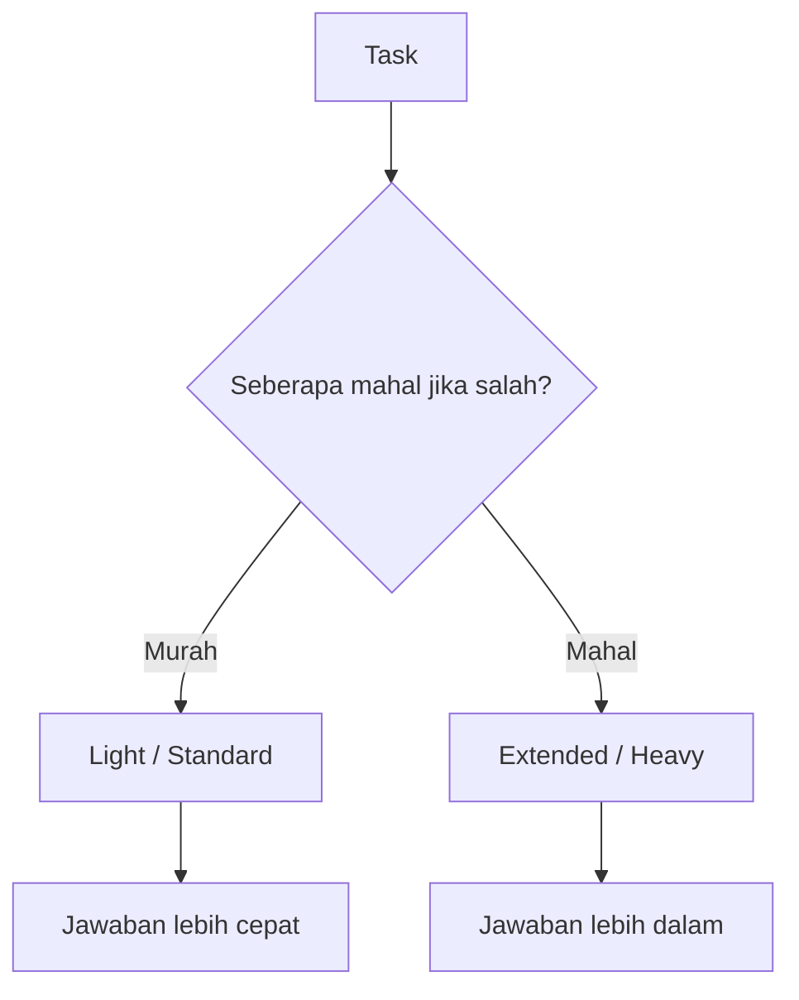

# BK-03: Thinking Selector Guide

## Gampangnya...

Selector thinking adalah pengatur "seberapa dalam" model harus berpikir sebelum menjawab. Ini bukan sekadar kosmetik UI. Pilihan ini memengaruhi kecepatan, kedalaman analisis, dan efisiensi penggunaan model untuk task tertentu.

Kalau kamu sering bingung memilih Light, Standard, Extended, atau Heavy, dokumen ini adalah pegangan utamanya.

> Status per 2026-03-28.
> Di ChatGPT, opsi selector dapat berbeda tergantung plan dan model yang dipilih.

---

## Konteks & Sejarah

Tidak semua tugas butuh reasoning yang sama. Prompt seperti "rapikan paragraf ini" jelas tidak membutuhkan effort yang sama dengan "debug race condition lintas tiga modul".

Karena itu, ChatGPT memberi kontrol tambahan di atas nama model:
- pilih modelnya,
- lalu tentukan kedalaman berpikirnya jika model tersebut mendukungnya.

Secara praktis, ini memberi user kendali lebih baik antara:
- cepat vs teliti,
- hemat vs berat,
- respons langsung vs analisis bertahap.

---

## Cara Kerja

### Prinsip Dasar

### Makna Praktis Tiap Level

| Level | Karakter | Cocok Untuk |
|---|---|---|
| **Light** | Paling ringan dan cepat | Tanya cepat, tugas jelas, edit kecil |
| **Standard** | Default aman | Q&A harian, drafting, coding biasa |
| **Extended** | Analisis lebih panjang | Debug menengah, review teknis, synthesis |
| **Heavy** | Paling sabar dan paling dalam | Problem ambigu, audit kritis, keputusan mahal |

Catatan:
- Plus/Business tidak selalu mendapat semua level.
- Pro dapat memiliki opsi tambahan.
- Tampilan selector bisa berubah sesuai plan dan rollout produk.
- Selector ini tersedia di ChatGPT Web, dan preferensinya tidak selalu sinkron ke mobile.

---

## Kapan Digunakan

### Pakai Light jika:

- tugasmu sempit dan jelas,
- kamu hanya butuh jawaban cepat,
- kamu sedang iterasi ringan.

### Pakai Standard jika:

- kamu ingin default yang aman,
- task tidak sepele, tapi juga tidak terlalu berisiko,
- kamu sedang menulis, meringkas, atau coding biasa.

### Pakai Extended jika:

- kamu sedang membandingkan beberapa opsi,
- kamu butuh model berpikir sedikit lebih lama,
- ada beberapa langkah yang harus dijaga urutannya.

### Pakai Heavy jika:

- salah sedikit bisa mahal,
- masalahnya ambigu,
- kamu sedang audit, debug berat, atau keputusan arsitektur penting.

---

## Cara Pakai

### Decision Rule Sederhana

| Kondisi | Selector Awal |
|---|---|
| Tugas kecil dan jelas | Light |
| Tugas umum harian | Standard |
| Tugas teknis dengan beberapa langkah | Extended |
| Tugas penting dan ambigu | Heavy |

### Fakta Penting yang Sering Terlewat

- Untuk Plus dan Business, `Standard` adalah default baru dan `Extended` tersedia untuk task yang butuh waktu berpikir lebih lama.
- User Pro mendapat dua opsi tambahan: `Light` dan `Heavy`.
- Sekali kamu mengubah thinking time di web, preferensi itu akan dipakai lagi sampai kamu mengubahnya.

### Aturan Naik Level

Naikkan selector jika:
- jawaban sebelumnya terlalu dangkal,
- model melompati langkah penting,
- kamu sedang mengejar akurasi, bukan sekadar kecepatan.

### Aturan Turun Level

Turunkan selector jika:
- kamu cuma edit kecil,
- kamu sedang mengejar iterasi cepat,
- hasil dari level berat terasa tidak memberi nilai tambah.

---

## Lab Praktek

**Skenario: satu task, empat selector**

Task:
"Analisis kenapa fitur login saya sering gagal saat traffic tinggi."

Bandingkan:
- `Light`: cocok untuk hipotesis cepat,
- `Standard`: cocok untuk gambaran awal,
- `Extended`: cocok untuk investigasi lebih runtut,
- `Heavy`: cocok untuk audit mendalam dan akar masalah yang mahal jika salah.

Pelajaran:
selector yang lebih berat tidak selalu "lebih baik", tapi lebih tepat untuk task yang menuntut kehati-hatian.

---

## Jebakan & Solusi

| Jebakan | Gejala | Solusi |
|---|---|---|
| **Heavy untuk semua hal** | Lambat dan terasa boros | Gunakan hanya untuk task mahal atau ambigu |
| **Light untuk task rumit** | Jawaban dangkal dan melompati detail | Naik ke Extended atau Heavy |
| **Selector dianggap mitos** | Memilih asal-asalan | Perlakukan selector sebagai budget kedalaman berpikir |
| **Tidak cek plan** | Bingung kenapa opsi berbeda | Ingat bahwa availability bergantung pada plan |

---

## Referensi Resmi

- https://help.openai.com/en/articles/11909943-gpt-53-and-gpt-54-in-chatgpt/

---

## Materi Selanjutnya

- [BK-04: Weekly Quota and Usage Strategy](../BK-04-Weekly-Quota-and-Usage-Strategy/README.md)
