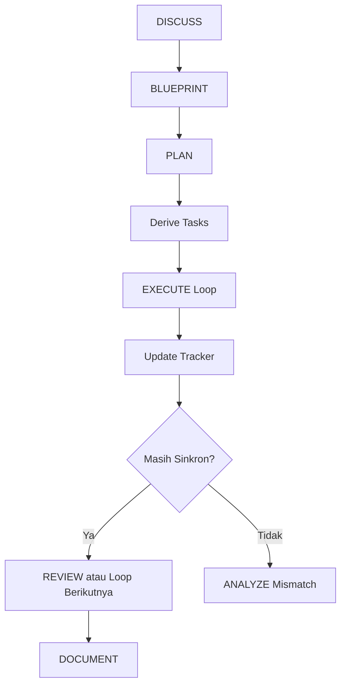

# BK-07: Sinkronisasi Task, Implementation Plan, dan Tracker

## Gampangnya...

Kalau `implementation plan` adalah peta perjalanan, maka `tasks` adalah daftar langkah kaki, dan `tracker` adalah penunjuk posisi kamu sekarang. Masalah mulai muncul saat tiga hal ini saling bicara tapi tidak sinkron.

Untuk model cepat seperti `Gemini Flash`, mismatch kecil antara plan dan task bisa langsung berubah jadi blunder: AI mengerjakan langkah yang salah, merasa sudah selesai padahal belum, atau meloncat ke tahap berikutnya tanpa dasar yang benar. Buku ini dibuat untuk menertibkan hubungan itu.

---

## Konteks & Sejarah

Dalam praktik Antigravity, banyak user sudah punya:
- rancangan kerja,
- implementation plan,
- daftar tasks,
- dan target hasil yang cukup jelas.

Tetapi hasil masih sering kacau karena struktur dokumennya tidak punya hirarki yang tegas. `Implementation plan` berbicara tentang urutan makro, `tasks` berbicara tentang aksi mikro, tetapi keduanya sering diperlakukan seperti sumber kebenaran yang setara.

Untuk model reasoning berat, konflik seperti ini kadang masih bisa diselamatkan karena modelnya sempat menebak konteks yang benar. Untuk model cepat seperti `Gemini Flash`, konflik seperti ini jauh lebih berbahaya karena model cenderung mengikuti konteks yang paling dekat, paling baru, atau paling eksplisit.

Karena itu, optimisasi model cepat tidak cukup hanya dengan memilih model yang tepat. Ia juga butuh **discipline layer** agar artefak kerja tidak saling tabrak.

---

## Cara Kerja

### Empat Artefak Inti

| Artefak | Fungsi | Tidak Boleh Dipakai Untuk |
|---|---|---|
| `blueprint.md` | Menjelaskan bentuk solusi, scope, dan batasan | Status harian |
| `implementation-plan.md` | Menjelaskan urutan fase dan exit criteria | Checklist progres detail |
| `tasks.md` | Menjelaskan item eksekusi yang diturunkan dari plan | Membuat arah baru di luar plan |
| `tracker.md` | Menjelaskan posisi kerja saat ini | Menjadi tempat strategi atau scope baru |

### Hirarki Kebenaran

Gunakan urutan ini:

1. `blueprint.md` menentukan **arah solusi**
2. `implementation-plan.md` menentukan **urutan kerja**
3. `tasks.md` menentukan **aksi yang sedang disiapkan**
4. `tracker.md` menentukan **kebenaran status saat ini**

Formula sederhananya:

`Blueprint decides shape. Plan decides sequence. Tasks decide action. Tracker decides current truth.`

### Kontrak Sinkronisasi

Setiap task wajib punya induk yang jelas di implementation plan.

Minimalnya, tiap task harus menyebut:
- `task_id`
- `linked_plan_step`
- `status`
- `notes`

Sementara `tracker.md` minimal harus menyebut:
- `current_mode`
- `current_plan_step`
- `active_task_id`
- `status`
- `last_completed`
- `mismatch_check`

### State Flow Sehat



### Empat Jenis Drift yang Harus Diwaspadai

| Drift | Gejala | Dampak |
|---|---|---|
| **Orphan Task** | task tidak punya `linked_plan_step` | AI mengerjakan sesuatu tanpa dasar urutan |
| **Plan Drift** | plan berubah tetapi tasks belum ikut | task menjadi usang atau salah prioritas |
| **Stale Tracker** | tracker menunjuk task lama | AI merasa masih ada di fase sebelumnya |
| **False Completion** | task dicentang tetapi tracker belum berpindah | progres terlihat selesai padahal state belum bersih |

---

## Kapan Digunakan

Gunakan buku ini saat:
- `Gemini Flash` atau model cepat lain sering meloncat langkah,
- implementation plan dan task list terasa mirip tapi tidak sinkron,
- kamu mulai bingung AI sedang berada di fase apa,
- sesi kerja sudah punya banyak artefak tapi progresnya sulit diaudit,
- kamu ingin memaksa AI berhenti saat ada konflik status, bukan improvisasi.

Jangan jadikan buku ini beban untuk task receh satu langkah. Buku ini paling berguna saat kerja sudah mulai bertahap, multi-loop, atau melibatkan handoff antar sesi.

---

## Cara Pakai

### Aturan Emas

1. Jangan mulai `tasks.md` sebelum implementation plan cukup jelas.
2. Jangan jalankan task yang belum terhubung ke langkah plan.
3. Setelah satu loop selesai, update `tasks.md` dan `tracker.md`.
4. Jika `tasks.md` dan `implementation-plan.md` bertentangan, masuk ke `ANALYZE`, jangan improvisasi.
5. Perlakukan `tracker.md` sebagai panel status utama untuk model cepat.

### Template Minimal

`implementation-plan.md`

```md
# Implementation Plan

## Step 1 - Foundation
- tujuan:
- output:
- exit criteria:

## Step 2 - Core Logic
- tujuan:
- output:
- exit criteria:
```

`tasks.md`

```md
# Tasks

- [ ] T-01
  linked_plan_step: Step 1
  title: Siapkan struktur awal

- [ ] T-02
  linked_plan_step: Step 2
  title: Implementasi logika inti
```

`tracker.md`

```md
# Tracker

current_mode: EXECUTE
current_plan_step: Step 1
active_task_id: T-01
status: in_progress

last_completed:
- none

mismatch_check:
- tasks_vs_plan: aligned
- tracker_vs_tasks: aligned
```

### Prompt Operasional untuk Gemini Flash

```text
Sebelum lanjut, baca tracker.md dulu.
Pastikan active_task_id masih terhubung ke implementation-plan.md.
Jika tasks, tracker, dan implementation plan tidak sinkron,
jangan improvisasi. Laporkan mismatch-nya dulu.
```

### Ritme Loop yang Disarankan

1. Baca `tracker.md`
2. Validasi `active_task_id`
3. Kerjakan satu task aktif saja
4. Update `tasks.md`
5. Update `tracker.md`
6. Baru lanjut ke loop berikutnya

---

## Lab Praktek

**Skenario: Gemini Flash diminta membangun fitur bertahap**

Kondisi awal:
- implementation plan punya 4 langkah,
- tasks sudah dibuat,
- tetapi tracker belum menunjuk task aktif dengan jelas.

Gejala yang biasanya muncul:
- AI langsung loncat ke implementasi inti,
- task review kelewat,
- atau AI merasa langkah foundation sudah selesai padahal belum diverifikasi.

Dengan buku ini, workflow yang benar menjadi:

1. pastikan `tracker.md` menunjuk `Step 1` dan `T-01`,
2. minta AI hanya mengerjakan `T-01`,
3. setelah selesai, update status task dan tracker,
4. baru pindah ke `T-02`.

Hasilnya:
- AI tidak lagi mengandalkan tebakan urutan,
- progres bisa dibaca ulang oleh sesi berikutnya,
- dan mismatch bisa terdeteksi sebelum berubah jadi error implementasi.

---

## Jebakan & Solusi

| Jebakan | Gejala | Solusi |
|---|---|---|
| **Plan dan task dibuat setara** | Dua dokumen sama-sama memberi arah | Jadikan task sebagai turunan plan, bukan pesaing plan |
| **Tracker dianggap opsional** | AI harus membaca ulang semua artefak tiap loop | Jadikan `tracker.md` sebagai panel status utama |
| **Task dicentang tanpa update tracker** | Status terlihat maju tapi fase masih lama | Tutup setiap loop dengan update tracker |
| **Mismatch diabaikan** | AI mengisi celah dengan improvisasi | Wajib pindah ke `ANALYZE` saat ada konflik |
| **Terlalu banyak artefak kecil** | User lelah menjaga dokumen | Pertahankan hanya empat artefak inti |

---

## Materi Sebelumnya

- [BK-05: Quota Strategy and Task Routing](../BK-05-Quota-Strategy-and-Task-Routing/README.md)
- [BK-06: Playbook Pemilihan Model per Jenis Kerja](../BK-06-Playbook-Pemilihan-Model-per-Jenis-Kerja/README.md)
