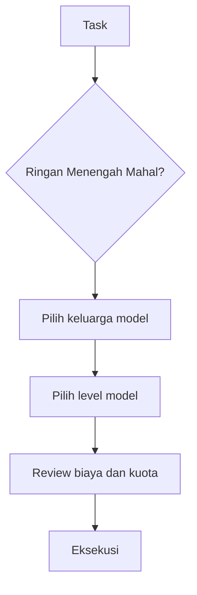

# SR-04: Antigravity Model Optimization

Sub-rak ini membahas cara memahami dan mengoptimalkan model-model premium yang tersedia di Antigravity. Fokus utamanya bukan sekadar mengenal nama model, tetapi memilih model yang tepat untuk task yang tepat agar kualitas kerja tetap tinggi tanpa membakar kuota terlalu cepat.

> Status per 2026-03-28.
> Daftar model di sub-rak ini disusun berdasarkan lineup yang tersedia pada akun premium yang sedang kamu gunakan. Availability model dan pola limit dapat berubah.

---

## Gampangnya...

Antigravity itu seperti garasi yang berisi banyak mesin. Masalahnya, mesin yang paling kuat bukan berarti harus dipakai untuk semua pekerjaan. Kadang pekerjaan ringan cukup ditangani model hemat. Kadang pekerjaan penting memang layak dinaikkan ke model yang lebih mahal.

Jadi sub-rak ini bukan cuma menjawab "model ini bagus atau tidak", tapi juga:
- bagus untuk apa,
- mahalnya sepadan atau tidak,
- kapan harus dipakai,
- kapan harus ditahan.

---

## Konteks & Sejarah

Begitu platform AI mulai menggabungkan banyak model di satu tempat, cara kerja user ikut berubah. Dulu kita cukup bertanya "pakai model apa?" Sekarang pertanyaannya lebih rumit:
- ini task ringan atau mahal kalau salah?
- model ini cocok untuk blueprint, execute, review, atau debug?
- apakah saya sedang membayar kualitas, atau hanya membayar prestige?
- bagaimana menjaga model premium tetap tersedia untuk kerja yang memang penting?
- bagaimana menjaga `tasks`, `implementation plan`, dan status kerja tetap sinkron?

Sub-rak ini dibuat untuk menjawab kebutuhan itu dalam konteks Antigravity: sebuah lingkungan kerja multi-model yang perlu disiplin routing, bukan sekadar selera model.

---

## Cara Kerja

### Tiga Lapisan Keputusan

### Keluarga Model yang Dibahas

| Keluarga | Fokus Umum |
|---|---|
| **Gemini** | reasoning kuat, context besar, mode cepat vs dalam |
| **Claude** | reasoning rapi, review, writing, audit bernuansa |
| **GPT-OSS / Economy** | tugas hemat, volume tinggi, draft awal |

---

## Kapan Digunakan

Gunakan sub-rak ini saat kamu mengalami salah satu kondisi berikut:
- bingung memilih model di Antigravity,
- kuota cepat habis,
- semua task terasa ingin dinaikkan ke model premium,
- ingin tahu model mana yang cocok untuk blueprint, review, debug, atau execute.
- ingin mencegah model cepat seperti `Gemini Flash` offside karena task dan plan tidak sinkron.

Kalau kamu ingin memakai lineup model Antigravity secara strategis, mulai dari sub-rak ini.

---

## Cara Pakai

### Urutan Baca yang Disarankan

1. Baca [BK-01: Antigravity Model Landscape](./BK-01-Antigravity-Model-Landscape/README.md) untuk memahami peta model.
2. Baca [BK-05: Quota Strategy and Task Routing](./BK-05-Quota-Strategy-and-Task-Routing/README.md) agar cara berpikir penghematan kuotanya benar dulu.
3. Masuk ke [BK-02](./BK-02-Gemini-Family-in-Antigravity/README.md), [BK-03](./BK-03-Claude-Family-in-Antigravity/README.md), dan [BK-04](./BK-04-GPT-OSS-and-Economy-Models/README.md) sesuai keluarga model yang ingin kamu pahami.
4. Gunakan [BK-06: Playbook Pemilihan Model per Jenis Kerja](./BK-06-Playbook-Pemilihan-Model-per-Jenis-Kerja/README.md) sebagai cheat sheet operasional harian.
5. Gunakan [BK-07: Sinkronisasi Task, Implementation Plan, dan Tracker](./BK-07-Sinkronisasi-Task-Implementation-Plan-dan-Tracker/README.md) jika kamu memakai model cepat dan ingin progres kerja tetap tertib.
6. Gunakan [BK-08: Template Artefak Workflow untuk Gemini Flash](./BK-08-Template-Artefak-Workflow-untuk-Gemini-Flash/README.md) jika kamu ingin format siap pakai untuk proyek nyata.

### Prinsip Dasar

- model terbaik tidak selalu model paling efisien,
- model premium disimpan untuk task yang salahnya mahal,
- model hemat adalah alat strategis, bukan opsi buangan,
- routing task yang baik lebih penting daripada gengsi memakai model teratas.

---

## Lab Praktek

**Skenario: hari kerja campuran**

Pagi:
- gunakan model premium untuk blueprint, analisis inti, atau debug berat.

Siang:
- turunkan ke model yang lebih hemat untuk drafting, rewrite, atau pekerjaan volume tinggi.

Sore:
- jika ada keputusan penting, naikkan lagi ke model yang paling tepat untuk review final.

Pelajarannya:
Antigravity paling kuat saat kamu memperlakukan model seperti tim dengan peran berbeda, bukan seperti satu palu untuk semua paku.

---

## Jebakan & Solusi

| Jebakan | Gejala | Solusi |
|---|---|---|
| **Premium bias** | Semua task naik ke model teratas | Klasifikasikan task dulu sebelum pilih model |
| **Economy shame** | Model hemat tidak pernah dipakai | Gunakan economy model untuk draft dan volume |
| **Quota panic** | Kuota menipis terlalu cepat | Pindahkan task ringan ke model hemat lebih awal |
| **Model confusion** | User hafal nama model tapi tidak tahu perannya | Mulai dari BK-01 dan BK-05 |

---

## Buku Utama

- [BK-01: Antigravity Model Landscape](./BK-01-Antigravity-Model-Landscape/README.md)
- [BK-02: Gemini Family in Antigravity](./BK-02-Gemini-Family-in-Antigravity/README.md)
- [BK-03: Claude Family in Antigravity](./BK-03-Claude-Family-in-Antigravity/README.md)
- [BK-04: GPT-OSS and Economy Models](./BK-04-GPT-OSS-and-Economy-Models/README.md)
- [BK-05: Quota Strategy and Task Routing](./BK-05-Quota-Strategy-and-Task-Routing/README.md)
- [BK-06: Playbook Pemilihan Model per Jenis Kerja](./BK-06-Playbook-Pemilihan-Model-per-Jenis-Kerja/README.md)
- [BK-07: Sinkronisasi Task, Implementation Plan, dan Tracker](./BK-07-Sinkronisasi-Task-Implementation-Plan-dan-Tracker/README.md)
- [BK-08: Template Artefak Workflow untuk Gemini Flash](./BK-08-Template-Artefak-Workflow-untuk-Gemini-Flash/README.md)
