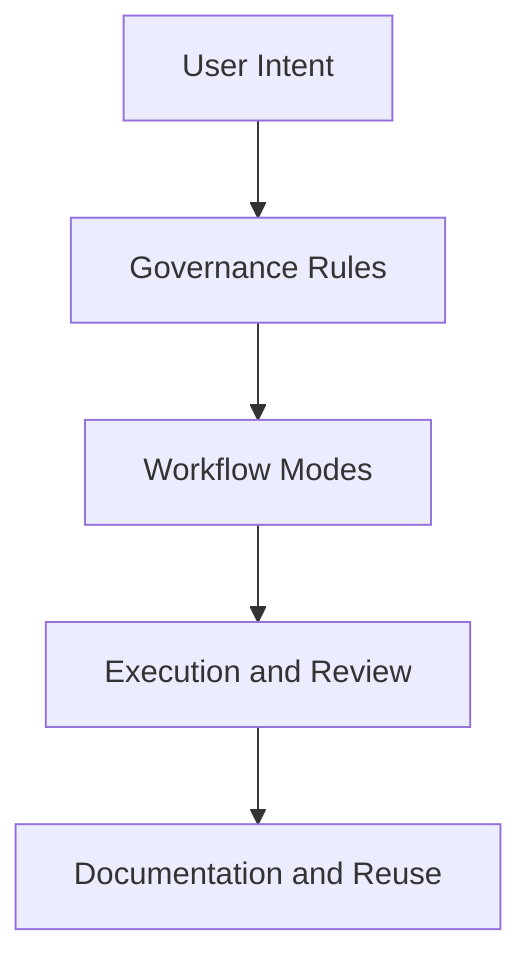

# Cursor SOP: The Constitution of Agentic AI Coding

> "AI is the engine, but the SOP is the steering wheel; without a steering wheel, speed is just a liability."

## Gampangnya...

`Cursor-SOP` adalah perpustakaan aturan kerja untuk mengendalikan AI coding agar tidak asal cepat, tetapi tetap tunduk pada arah arsitektur yang jelas. Repo ini membantu kita membedakan kapan AI harus berdiskusi, kapan harus merancang, kapan boleh mengeksekusi, dan bagaimana hasilnya harus diaudit.

Kalau AI tanpa SOP itu seperti tukang yang langsung membongkar tembok tanpa gambar kerja, maka repo ini adalah buku mandor yang memastikan semua tenaga mesin tetap berada di jalurnya.

---

## Konteks & Sejarah

Ekosistem AI coding bergerak sangat cepat. Model makin kuat, context window makin panjang, dan tool makin agresif melakukan eksekusi. Tapi tanpa governance yang baik, kekuatan itu mudah berubah jadi sumber blunder:
- AI menulis kode sebelum paham konteks,
- bugfix melebar jadi refactor liar,
- dokumentasi tertinggal,
- kualitas antar proyek jadi tidak konsisten.

Karena itu, `Cursor-SOP` dibangun sebagai **hub governance agentic coding**. Fungsinya bukan hanya mengajari prompt, tapi menetapkan cara kerja, guardrail, dan pola orkestrasi yang bisa dipakai ulang lintas proyek.

---

## Cara Kerja

### Tiga Lapisan Utama



### Prinsip Arsitektural

1. **Governance first**  
   AI tidak boleh hanya cepat; ia harus patuh pada aturan kerja.
2. **Discuss before execute**  
   Mode default adalah diskusi, analisis, dan blueprinting.
3. **One-tier unified knowledge**  
   Semua RAK berada di root, tidak ada lagi pemisahan `TECHNICAL-CORE`.
4. **Living documentation**  
   SOP harus terus diupdate mengikuti tool, model, dan praktik lapangan.

### Struktur Pengetahuan

Repositori ini memakai hierarki:

```text
RAK -> SR -> BK -> CH -> SC
```

Dan seluruh isinya mengikuti governance di [docs/root-governance.md](./docs/root-governance.md).

---

## Kapan Digunakan

Repo ini relevan ketika kamu ingin:
- membuat AI lebih patuh dan tidak offside,
- membedakan fase `DISCUSS`, `BLUEPRINT`, `PLAN`, `ANALYZE`, `EXECUTE`, `REVIEW`, `DEBUG`, `TEST`, `REFACTOR`, dan `DOCUMENT`,
- menyusun standar kerja lintas proyek,
- memahami cara memilih model, mode, dan workflow AI,
- mengubah sesi AI menjadi sistem kerja yang bisa diwariskan.

Kalau kebutuhanmu adalah governance, workflow, orkestrasi, dan standar operasi AI coding, mulai dari repo ini.

---

## Cara Pakai

### Urutan Masuk yang Disarankan

1. Mulai dari [RAK-00-The-Gateway](./RAK-00-The-Gateway/README.md) jika kamu butuh onboarding cepat.
2. Baca [RAK-02-Foundation-Core-Rules](./RAK-02-Foundation-Core-Rules/README.md) untuk memahami hukum dasar.
3. Masuk ke [RAK-03-Evolution-Interfacing](./RAK-03-Evolution-Interfacing/README.md) untuk blueprinting dan workflow umum.
4. Gunakan [RAK-07-Specialization](./RAK-07-Specialization/README.md) untuk pola kerja spesialis, termasuk kurator workflow.
5. Gunakan [RAK-09-AI-Arsenal](./RAK-09-AI-Arsenal/README.md) untuk pemilihan model, selector thinking, dan strategi kuota.

### File Inti yang Wajib Dipahami

- [docs/root-governance.md](./docs/root-governance.md)
- [.cursorrules](./.cursorrules)
- [status.md](./status.md)
- [CHANGELOG.md](./CHANGELOG.md)

### Peta Rak

1. [RAK-00-The-Gateway](./RAK-00-The-Gateway/README.md): pintu masuk, quick start, glossary, living updates.
2. [RAK-01-Anatomy-Landscape](./RAK-01-Anatomy-Landscape/README.md): evolusi AI coding dan mindset dasar.
3. [RAK-02-Foundation-Core-Rules](./RAK-02-Foundation-Core-Rules/README.md): hukum dasar dan batas interaksi.
4. [RAK-03-Evolution-Interfacing](./RAK-03-Evolution-Interfacing/README.md): blueprinting, workflow, dan sinkronisasi visi.
5. [RAK-04-Core-Mechanics-Internals](./RAK-04-Core-Mechanics-Internals/README.md): RAG, token, context, indexing.
6. [RAK-05-Ecosystem-Tooling](./RAK-05-Ecosystem-Tooling/README.md): `.cursorrules`, tooling, tuning, integrasi, dan arsitektur rules bertingkat.
7. [RAK-06-The-Underworld](./RAK-06-The-Underworld/README.md): prompt patterns, context anchoring, reasoning depth.
8. [RAK-07-Specialization](./RAK-07-Specialization/README.md): multi-agent, review ritual, curator workflows.
9. [RAK-08-Matrix-Intersection](./RAK-08-Matrix-Intersection/README.md): sinkronisasi standar lintas proyek.
10. [RAK-09-AI-Arsenal](./RAK-09-AI-Arsenal/README.md): pemilihan model, ChatGPT usage, quota strategy.

---

## Lab Praktek

**Skenario: Memulai proyek baru bersama AI**

1. Baca [RAK-02-Foundation-Core-Rules](./RAK-02-Foundation-Core-Rules/README.md).
2. Minta AI menganalisis struktur proyek dan menjelaskan pemahamannya.
3. Paksa AI masuk ke fase `BLUEPRINT` sebelum coding.
4. Gunakan `REVIEW` dan `DOCUMENT` di akhir sesi agar keputusan tidak hilang.

**Skenario: Menstandarkan workflow lintas proyek**

1. Jadikan repo ini sebagai pusat referensi.
2. Sinkronkan aturan ke `.cursorrules` proyek aktif.
3. Audit hasil AI secara berkala menggunakan ritual review dan documentation.

---

## Jebakan & Solusi

| Jebakan | Gejala | Solusi |
|---|---|---|
| **Mengira repo ini hanya kumpulan prompt** | User mengambil potongan tips tanpa memahami sistemnya | Mulai dari root governance dan RAK dasar |
| **Langsung loncat ke rak spesialis** | Workflow terasa berat atau kabur | Kuasai RAK-02 dan RAK-03 dulu |
| **Dokumentasi pusat tidak diupdate** | SOP dan praktik lapangan mulai berbeda | Gunakan `CHANGELOG` dan living updates secara disiplin |
| **Salah membaca struktur repo** | Masih mengira arsitekturnya two-tier atau 8-rak | Ikuti status terbaru: one-tier unified dengan `RAK-00` sampai `RAK-09` |

---

## Status Proyek

Status ringkas dapat dilihat di [status.md](./status.md).

> Catatan
> Repositori ini mengikuti governance **PPM V6 Unified** dan terus berkembang sebagai living document.

