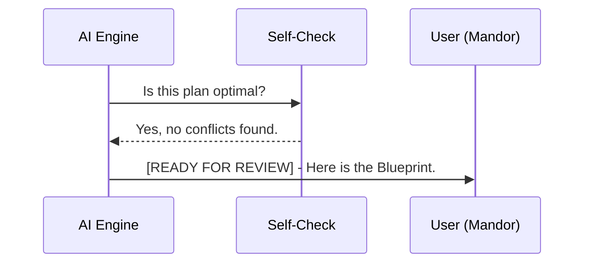

# CH-01: Multi-Phase Validation

## 📖 1. Self-Correction Before Submission
Sebelum AI menyodorkan Blueprint ke User (Mandor), AI wajib melakukan **Self-Audit** internal untuk memastikan rencana tersebut logis dan aman.

## ⚙️ 2. Validation Phases
1.  **Draft Phase**: AI merancang alur logika mentah.
2.  **Integrity Check**: AI mengecek apakah ada file penting yang terlewat dari daftar perubahan.
3.  **Conflict Check**: Apakah ada aturan di `.cursorrules` yang dilanggar oleh rencana ini?
4.  **Submission**: Blueprint siap disodorkan kepada User dengan label `[READY FOR REVIEW]`.

## 📊 3. Validation Loop

## ⚠️ 4. Anti-Patterns
- **The "Blind Shot"**: Langsung memberikan kode tanpa Blueprint.
- **The "Vague Plan"**: Memberikan rencana yang tidak menyebutkan file secara spesifik.
