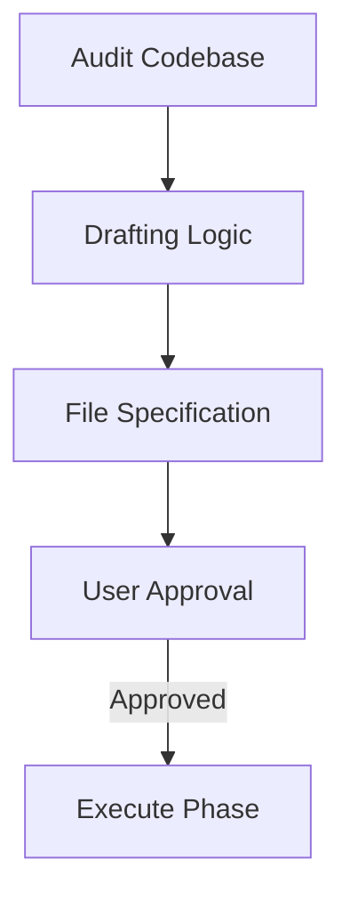

# BK-01: The Blueprint Standard

## 📖 1. Apa itu Blueprint Standard?
Blueprint adalah **Kontrak Kerja** antara AI dan User. Tanpa Blueprint yang baku, AI berisiko melakukan perubahan yang tidak sinkron dan merusak sistem.

## ⚙️ 2. Komponen Wajib Blueprint
Setiap Blueprint yang diajukan AI wajib berisi:
1.  **Scope**: Daftar file yang akan diubah dan file yang hanya akan dibaca.
2.  **Logic**: Penjelasan alur kode baru (step-by-step).
3.  **Impact**: Apa dampak perubahan ini terhadap fitur lain yang sudah ada?
4.  **Verification**: Bagaimana rencana pengetesan setelah koding selesai?

## 📊 3. Format Teknis

## 🚀 4. Benefit
Mengurangi tingkat kegagalan koding hingga 80% karena semua rencana sudah dimatangkan di fase diskusi.
